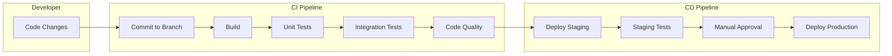

# CI/CD Pipeline Architecture
## CampusIntelli Portal

---

## Overview

This document describes the Continuous Integration and Continuous Deployment pipeline for CampusIntelli.

---

## Pipeline Stages



---

## Stage Details

### Stage 1: Commit

| Action | Tool | Trigger |
|--------|------|---------|
| Push to feature branch | Git | Developer action |
| Create Pull Request | GitHub | Developer action |
| Run pre-commit hooks | Git Hooks | On commit |

**Pre-commit Checks:**
- Python linting (flake8)
- Code formatting (black)
- Sort imports (isort)

### Stage 2: Build & Test (CI)

| Step | Tool | Duration | Pass Criteria |
|------|------|----------|---------------|
| Install Dependencies | pip | ~30s | Exit code 0 |
| Run Unit Tests | pytest | ~60s | All pass |
| Run Integration Tests | pytest | ~90s | All pass |
| Code Coverage | pytest-cov | - | >80% |
| Static Analysis | flake8 | ~10s | No errors |

### Stage 3: Deploy to Staging

| Step | Tool | Target |
|------|------|--------|
| Build Docker Image | Docker | staging |
| Push to Registry | DockerHub | staging tag |
| Deploy Container | Docker Compose | Staging server |
| Run Smoke Tests | pytest | Staging endpoints |

### Stage 4: Deploy to Production

| Step | Tool | Trigger |
|------|------|---------|
| Manual Approval | GitHub Actions | Maintainer approval |
| Blue-Green Switch | Nginx | Zero-downtime |
| Health Check | curl | /health endpoint |
| Rollback (if needed) | Script | Automatic on failure |

---

## GitHub Actions Workflow

```yaml
# .github/workflows/ci-cd.yml
name: CampusIntelli CI/CD

on:
  push:
    branches: [main, develop]
  pull_request:
    branches: [main]

jobs:
  test:
    runs-on: ubuntu-latest
    steps:
      - uses: actions/checkout@v3
      
      - name: Set up Python
        uses: actions/setup-python@v4
        with:
          python-version: '3.9'
      
      - name: Install dependencies
        run: |
          pip install -r requirements.txt
          pip install pytest pytest-cov flake8
      
      - name: Lint with flake8
        run: flake8 backend/ --max-line-length=120
      
      - name: Run tests
        run: pytest tests/ -v --cov=backend --cov-report=xml
      
      - name: Upload coverage
        uses: codecov/codecov-action@v3

  deploy-staging:
    needs: test
    if: github.ref == 'refs/heads/develop'
    runs-on: ubuntu-latest
    steps:
      - name: Deploy to Staging
        run: echo "Deploy to staging server"

  deploy-production:
    needs: test
    if: github.ref == 'refs/heads/main'
    runs-on: ubuntu-latest
    environment: production
    steps:
      - name: Deploy to Production
        run: echo "Deploy to production server"
```

---

## Branch Strategy

```
main (production)
  │
  ├── develop (staging)
  │     │
  │     ├── feature/auth-login
  │     ├── feature/timetable
  │     ├── feature/assignments
  │     └── bugfix/login-error
  │
  └── hotfix/critical-security
```

| Branch | Purpose | Deploy Target |
|--------|---------|---------------|
| main | Production code | Production |
| develop | Integration branch | Staging |
| feature/* | New features | - |
| bugfix/* | Bug fixes | - |
| hotfix/* | Emergency fixes | Production (fast-track) |

---

## Deployment Strategy: Blue-Green

```
                    Load Balancer
                         │
           ┌─────────────┴─────────────┐
           │                           │
    ┌──────┴──────┐             ┌──────┴──────┐
    │  BLUE ENV   │             │  GREEN ENV  │
    │  (v1.2.0)   │             │  (v1.3.0)   │
    │   Active    │             │   Standby   │
    └─────────────┘             └─────────────┘
```

**Process:**
1. Deploy new version to inactive environment (Green)
2. Run smoke tests on Green
3. Switch load balancer to Green
4. Keep Blue as rollback option
5. If issues: switch back to Blue

---

## Environment Configuration

| Environment | URL | Database | Purpose |
|-------------|-----|----------|---------|
| Development | localhost:5000 | data/*.json | Local dev |
| Staging | staging.campusintelli.com | staging-db | QA testing |
| Production | campusintelli.com | prod-db | Live users |

---

## Rollback Procedure

```
1. Detect failure (automated health check or manual)
2. Alert on-call engineer
3. Assess severity
4. If critical:
   a. Switch traffic to previous version (Blue)
   b. Investigate root cause
   c. Fix and redeploy
5. If minor:
   a. Deploy hotfix to current environment
   b. Monitor
```

---

## Monitoring & Alerting

| Metric | Tool | Alert Threshold |
|--------|------|-----------------|
| Response Time | Prometheus | >2s average |
| Error Rate | Sentry | >1% of requests |
| Uptime | UptimeRobot | <99.5% |
| CPU Usage | Grafana | >80% sustained |

---

## Security in Pipeline

| Check | Stage | Tool |
|-------|-------|------|
| Secret Scanning | Pre-commit | git-secrets |
| Dependency Audit | CI | pip-audit |
| Container Scanning | Build | Trivy |
| HTTPS Enforcement | Deploy | Nginx |

---

**Document Version**: 1.0  
**Last Updated**: 2026-01-31
