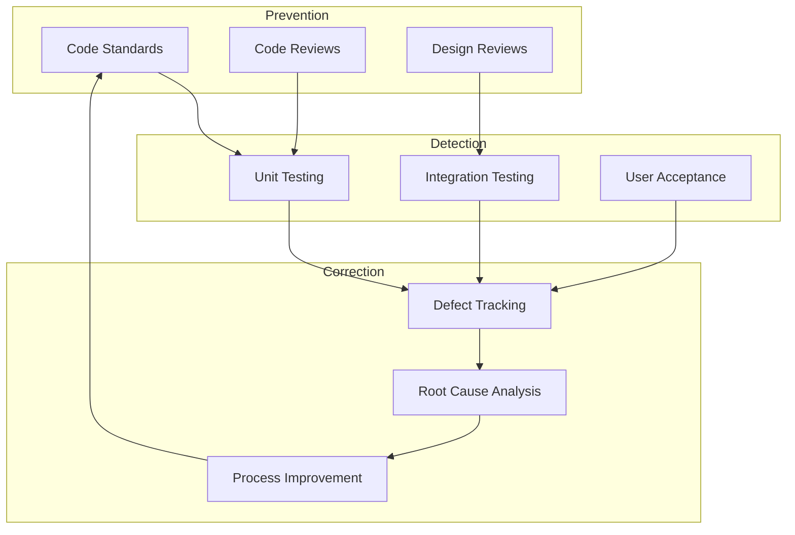
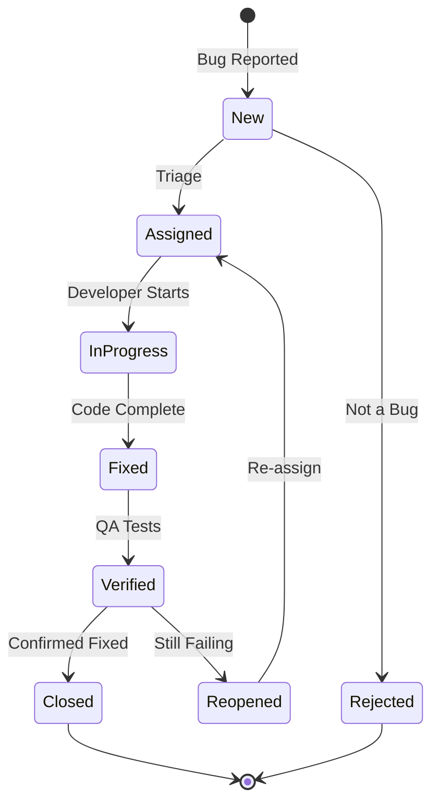

# Quality Assurance Plan
## CampusIntelli Portal

---

## Quality Objectives

| Objective | Target | Measurement |
|-----------|--------|-------------|
| Defect Density | <5 defects/KLOC | Bug tracking |
| Test Coverage | >80% | Coverage reports |
| User Satisfaction | >4.0/5.0 | Feedback surveys |
| System Uptime | >99.5% | Monitoring |
| Response Time | <2s | Performance tests |

---

## Quality Assurance Process



---

## Verification & Validation

### Verification ("Are we building the product right?")

| Activity | Method | When |
|----------|--------|------|
| Code Review | Peer review, PR comments | Every PR |
| Static Analysis | flake8, pylint | Every commit |
| Unit Tests | pytest | Every commit |
| Design Review | Team meeting | Sprint planning |

### Validation ("Are we building the right product?")

| Activity | Method | When |
|----------|--------|------|
| Sprint Demo | Live demonstration | End of sprint |
| User Acceptance | Student/Faculty testing | Before release |
| Prototype Review | Wireframe walkthrough | Design phase |
| Feedback Collection | Surveys, interviews | Post-release |

---

## Code Review Checklist

### Functionality
- [ ] Code implements the requirement correctly
- [ ] Edge cases are handled
- [ ] Error handling is appropriate

### Security
- [ ] No hardcoded secrets or credentials
- [ ] Input validation present
- [ ] Authentication/Authorization checks correct

### Performance
- [ ] No unnecessary database calls
- [ ] Efficient algorithms used
- [ ] Caching considered where appropriate

### Maintainability
- [ ] Code is readable and self-documenting
- [ ] Functions are small and focused
- [ ] DRY principle followed (no duplication)

### Testing
- [ ] Unit tests cover new code
- [ ] Tests are meaningful (not trivial)
- [ ] Edge cases tested

---

## Defect Management

### Defect Life Cycle



### Defect Report Template

| Field | Description |
|-------|-------------|
| ID | Unique identifier |
| Title | Brief description |
| Severity | Critical/High/Medium/Low |
| Priority | P1/P2/P3/P4 |
| Reporter | Who found it |
| Assignee | Who will fix it |
| Environment | Where it occurs |
| Steps to Reproduce | Detailed steps |
| Expected Result | What should happen |
| Actual Result | What actually happens |
| Attachments | Screenshots, logs |

---

## Quality Metrics

### Tracked Metrics

| Metric | Formula | Target |
|--------|---------|--------|
| Defect Density | Defects / KLOC | <5 |
| Defect Removal Efficiency | (Defects found pre-release / Total defects) × 100 | >85% |
| Review Efficiency | Defects found in review / Total review defects | >50% |
| Test Pass Rate | (Passed tests / Total tests) × 100 | >95% |
| Code Coverage | (Covered lines / Total lines) × 100 | >80% |

### Quality Dashboard

```
┌─────────────────────────────────────────────────────────┐
│                 QUALITY DASHBOARD                        │
├─────────────────┬─────────────────┬─────────────────────┤
│  Defect Trend   │  Test Coverage  │  Build Status       │
│                 │                 │                      │
│  ▄▃▂▁  ↓10%    │  ████████░░ 82% │  ✓ Passing          │
│                 │                 │                      │
├─────────────────┼─────────────────┼─────────────────────┤
│  Open Bugs: 12  │  Pass Rate: 97% │  Last Deploy: 2h    │
└─────────────────┴─────────────────┴─────────────────────┘
```

---

## Quality Gates

### Sprint Gate (End of Sprint)

| Criteria | Requirement |
|----------|-------------|
| All stories done | 100% complete |
| Test coverage | >80% |
| Critical bugs | 0 open |
| High bugs | ≤2 open |
| Code review | All PRs reviewed |

### Release Gate (Before Production)

| Criteria | Requirement |
|----------|-------------|
| All sprint gates passed | Yes |
| UAT sign-off | Approved |
| Performance test | All pass |
| Security scan | No critical issues |
| Documentation | Updated |
| Rollback plan | Documented |

---

## Continuous Improvement

### Sprint Retrospective Actions

| Category | Example Actions |
|----------|-----------------|
| What went well? | Continue code reviews |
| What didn't go well? | Improve test coverage |
| Action items | Add integration tests for API |

### Root Cause Analysis (5 Whys)

**Example:**
```
Problem: User couldn't submit assignment

Why 1: File upload failed
Why 2: Server returned 500 error
Why 3: File size exceeded limit
Why 4: Limit was 1MB, not 10MB as spec'd
Why 5: Dev used wrong config value

Root Cause: Configuration not reviewed
Action: Add config validation tests
```

---

## Quality Roles

| Role | Responsibilities |
|------|-----------------|
| Developer | Write unit tests, code review |
| QA Engineer | Test planning, integration tests, UAT |
| Tech Lead | Design review, quality standards |
| Scrum Master | Process adherence, metrics tracking |
| Product Owner | Accept/reject features, UAT approval |

---

**Document Version**: 1.0  
**Last Updated**: 2026-01-31
