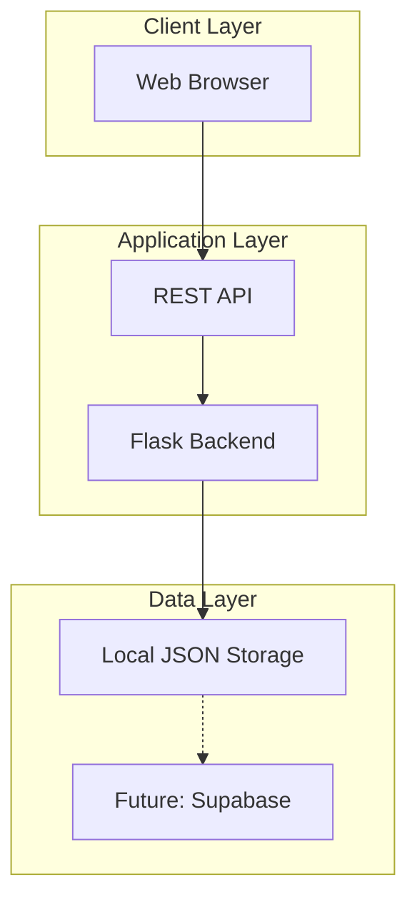

# Software Requirements Specification (SRS)
## CampusIntelli - Unified Campus Portal
### IEEE 830 Standard

---

## 1. Introduction

### 1.1 Purpose
This document specifies the software requirements for **CampusIntelli**, a unified digital hub designed to integrate key campus functions into a single, accessible platform for students, faculty, and administrators.

### 1.2 Scope
CampusIntelli will provide:
- **Academic Hub**: Timetables, assignments, gradebook, lecture materials
- **Campus Life & Resources**: Room booking, announcements, directory
- **Attendance & Analytics**: QR-based attendance, performance dashboards
- **Administration**: Role management, system configuration, reports

### 1.3 Definitions, Acronyms, and Abbreviations

| Term | Definition |
|------|------------|
| **SRS** | Software Requirements Specification |
| **QR** | Quick Response (code) |
| **CRUD** | Create, Read, Update, Delete |
| **API** | Application Programming Interface |
| **UI** | User Interface |
| **Admin** | Administrator |

### 1.4 References
- IEEE 830-1998 Standard for SRS
- Scrum Guide 2020
- COCOMO II Model

### 1.5 Overview
This document is organized into:
- Section 2: Overall Description
- Section 3: Specific Requirements
- Appendices: Data models, UI mockups

---

## 2. Overall Description

### 2.1 Product Perspective
CampusIntelli is a standalone web application that:
- Runs on modern web browsers (Chrome, Firefox, Edge, Safari)
- Uses Python Flask backend with local JSON storage (upgradeable to Supabase)
- Provides responsive UI for desktop and mobile devices

### 2.2 Product Functions

| Module | Functions |
|--------|-----------|
| **Authentication** | Login, Logout, Password Reset, Session Management |
| **Academic Hub** | View Timetable, Submit Assignment, View Grades, Access Materials |
| **Campus Services** | Book Room, View Announcements, Search Directory |
| **Attendance** | Generate QR, Scan QR, View Attendance Records |
| **Analytics** | View Performance Charts, Generate Reports |
| **Administration** | Manage Users, Configure System, Generate Reports |

### 2.3 User Classes and Characteristics

#### 2.3.1 Student
- **Description**: Enrolled students accessing academic resources
- **Permissions**: View timetable, submit assignments, view grades, book rooms, mark attendance
- **Technical Expertise**: Basic computer literacy

#### 2.3.2 Faculty
- **Description**: Teaching staff managing courses and students
- **Permissions**: All student permissions + create assignments, grade submissions, generate QR codes, view class analytics
- **Technical Expertise**: Moderate computer literacy

#### 2.3.3 Administrator
- **Description**: System administrators managing the platform
- **Permissions**: All permissions + user management, system configuration, global reports
- **Technical Expertise**: Advanced computer literacy

### 2.4 Operating Environment
- **Server**: Python 3.9+, Flask 2.x, Windows/Linux/macOS
- **Client**: Modern web browser with JavaScript enabled
- **Storage**: Local file system (JSON), future PostgreSQL via Supabase

### 2.5 Design and Implementation Constraints
1. Must use Python for backend development
2. Frontend must be HTML/CSS/JavaScript (no framework initially)
3. Local storage for MVP, Supabase integration planned
4. Must support concurrent users (min 50)
5. Must comply with data privacy regulations

### 2.6 Assumptions and Dependencies
- Users have stable internet connection
- Modern browser with JavaScript support
- Python 3.9+ installed for backend
- JSON file system access for local storage

---

## 3. Specific Requirements

### 3.1 External Interface Requirements

#### 3.1.1 User Interfaces
| Page | Description | Access |
|------|-------------|--------|
| Login | Authentication form with role selection | Public |
| Dashboard | Role-specific overview with quick actions | All authenticated |
| Timetable | Weekly/monthly schedule view | Students, Faculty |
| Assignments | List and submit/grade assignments | Students, Faculty |
| Booking | Room reservation calendar | All authenticated |
| Attendance | QR generation and scanning | Faculty, Students |
| Analytics | Charts and performance metrics | Faculty, Admin |
| Admin Panel | User and system management | Admin only |

#### 3.1.2 Hardware Interfaces
- None required (web-based application)

#### 3.1.3 Software Interfaces
| Interface | Description |
|-----------|-------------|
| Flask REST API | Backend communication |
| QRCode Library | QR code generation |
| Chart.js | Analytics visualization |
| LocalStorage API | Client-side caching |

### 3.2 Functional Requirements

#### FR-AUTH: Authentication Module

| ID | Requirement | Priority |
|----|-------------|----------|
| FR-AUTH-01 | System shall allow users to login with email and password | High |
| FR-AUTH-02 | System shall validate user credentials against stored data | High |
| FR-AUTH-03 | System shall maintain user session for 24 hours | Medium |
| FR-AUTH-04 | System shall allow users to logout | High |
| FR-AUTH-05 | System shall redirect users based on role after login | High |

#### FR-ACAD: Academic Module

| ID | Requirement | Priority |
|----|-------------|----------|
| FR-ACAD-01 | System shall display weekly timetable for enrolled courses | High |
| FR-ACAD-02 | System shall allow faculty to create assignments with due dates | High |
| FR-ACAD-03 | System shall allow students to upload assignment submissions | High |
| FR-ACAD-04 | System shall allow faculty to grade submissions | High |
| FR-ACAD-05 | System shall display gradebook with all course grades | High |
| FR-ACAD-06 | System shall allow faculty to upload lecture materials | Medium |

#### FR-BOOK: Booking Module

| ID | Requirement | Priority |
|----|-------------|----------|
| FR-BOOK-01 | System shall display available rooms/equipment | High |
| FR-BOOK-02 | System shall allow users to book resources for specific time slots | High |
| FR-BOOK-03 | System shall prevent double-booking of resources | High |
| FR-BOOK-04 | System shall send booking confirmation | Medium |
| FR-BOOK-05 | System shall allow cancellation up to 2 hours before booking | Medium |

#### FR-ATTD: Attendance Module

| ID | Requirement | Priority |
|----|-------------|----------|
| FR-ATTD-01 | System shall generate unique QR code for each lecture | High |
| FR-ATTD-02 | QR codes shall expire after 5 minutes | High |
| FR-ATTD-03 | System shall validate QR scan and mark attendance | High |
| FR-ATTD-04 | System shall display attendance percentage per course | Medium |
| FR-ATTD-05 | System shall prevent duplicate attendance marking | High |

#### FR-ANLY: Analytics Module

| ID | Requirement | Priority |
|----|-------------|----------|
| FR-ANLY-01 | System shall display course-wise grade distribution | Medium |
| FR-ANLY-02 | System shall show attendance trends over time | Medium |
| FR-ANLY-03 | System shall generate performance reports (PDF) | Low |
| FR-ANLY-04 | System shall provide class average comparisons | Medium |

#### FR-ADMN: Administration Module

| ID | Requirement | Priority |
|----|-------------|----------|
| FR-ADMN-01 | Admin shall be able to create/edit/delete user accounts | High |
| FR-ADMN-02 | Admin shall be able to assign roles to users | High |
| FR-ADMN-03 | Admin shall be able to configure system settings | Medium |
| FR-ADMN-04 | Admin shall be able to generate institution-wide reports | Medium |

### 3.3 Non-Functional Requirements

#### NFR-PERF: Performance

| ID | Requirement | Target |
|----|-------------|--------|
| NFR-PERF-01 | Page load time | < 2 seconds |
| NFR-PERF-02 | API response time | < 500ms |
| NFR-PERF-03 | Concurrent users supported | 50+ |

#### NFR-SEC: Security

| ID | Requirement |
|----|-------------|
| NFR-SEC-01 | Passwords must be hashed before storage |
| NFR-SEC-02 | All API endpoints must require authentication |
| NFR-SEC-03 | Session tokens must be encrypted |
| NFR-SEC-04 | Role-based access control must be enforced |

#### NFR-REL: Reliability

| ID | Requirement | Target |
|----|-------------|--------|
| NFR-REL-01 | System uptime | 99.5% |
| NFR-REL-02 | Data backup frequency | Daily |
| NFR-REL-03 | Mean time to recovery | < 1 hour |

#### NFR-USE: Usability

| ID | Requirement |
|----|-------------|
| NFR-USE-01 | Interface must be responsive (mobile + desktop) |
| NFR-USE-02 | Navigation must be intuitive (max 3 clicks to any feature) |
| NFR-USE-03 | Error messages must be user-friendly |

---

## 4. Appendices

### Appendix A: Data Dictionary
See Class Diagram in UML documentation.

### Appendix B: UI Wireframes
See prototype designs in design documentation.

---

**Document Version**: 1.0  
**Last Updated**: 2026-01-31  
**Author**: CampusIntelli Development Team
