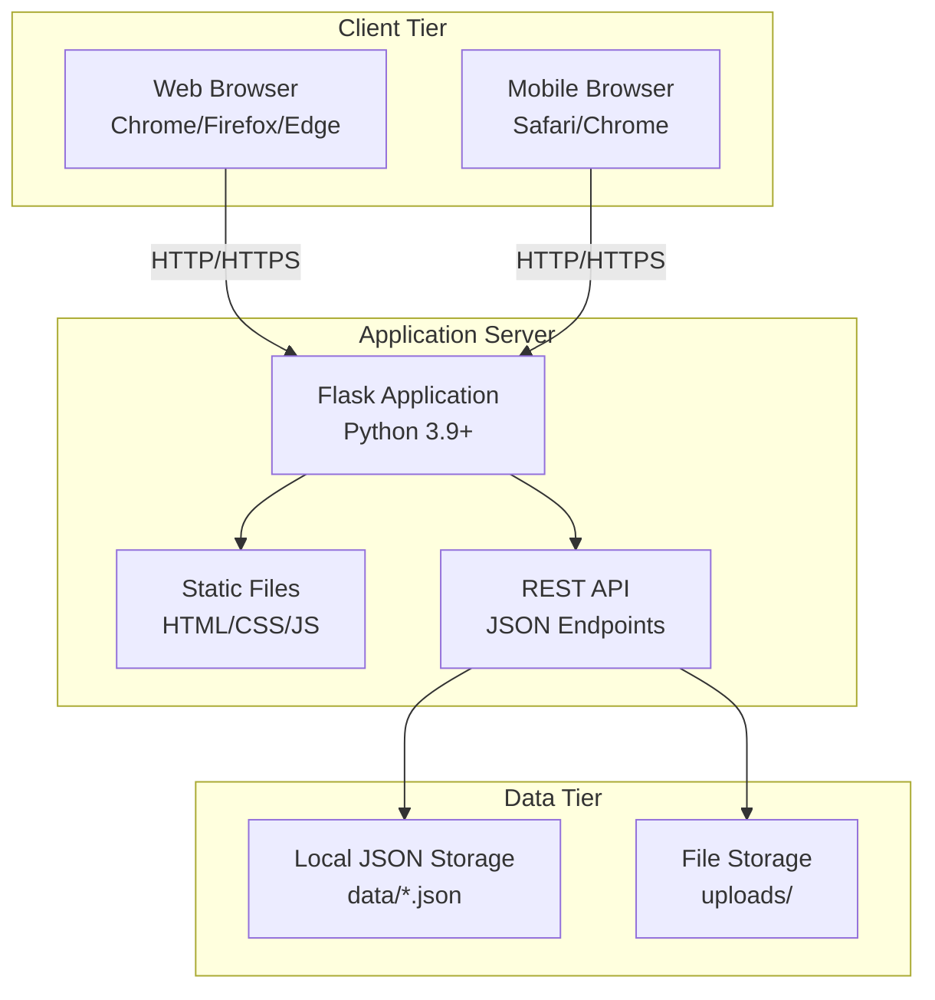
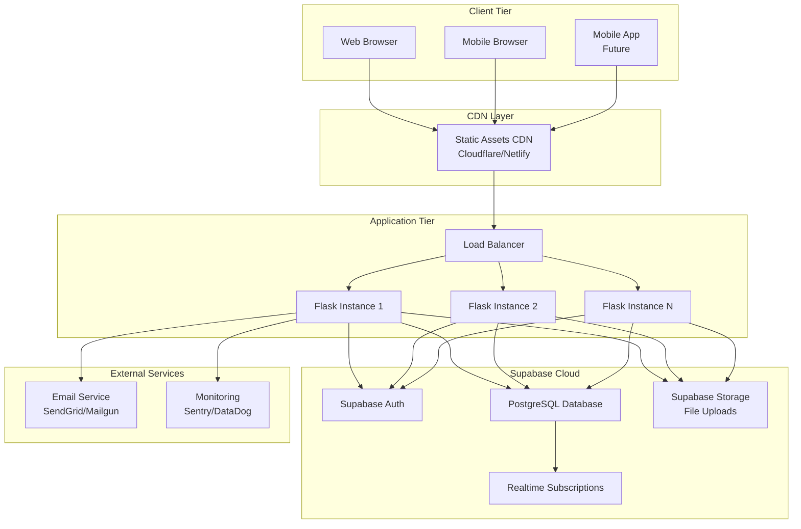

# Deployment Diagram
## CampusIntelli Portal

---

## Overview
This document shows the physical deployment architecture of the CampusIntelli system.

---

## Current Architecture (Local Development)



---

## Future Architecture (Production with Supabase)



---

## Component Details

### Client Tier

| Component | Technology | Description |
|-----------|------------|-------------|
| Web Browser | Chrome, Firefox, Edge | Desktop access |
| Mobile Browser | Safari, Chrome | Mobile responsive access |
| Mobile App | Future: Flutter/React Native | Native app (planned) |

### Application Tier

| Component | Technology | Port | Description |
|-----------|------------|------|-------------|
| Flask App | Python 3.9+ Flask 2.x | 5000 | Main application server |
| Static Server | Flask Static | - | Serves HTML/CSS/JS |
| REST API | Flask Blueprints | - | JSON API endpoints |

### Data Tier (Current - Local)

| Component | Format | Location | Description |
|-----------|--------|----------|-------------|
| users.json | JSON | data/ | User accounts |
| courses.json | JSON | data/ | Course catalog |
| assignments.json | JSON | data/ | Assignments & submissions |
| bookings.json | JSON | data/ | Room reservations |
| attendance.json | JSON | data/ | Attendance records |
| File Storage | Binary | uploads/ | Submission files |

### Data Tier (Future - Supabase)

| Component | Service | Description |
|-----------|---------|-------------|
| Authentication | Supabase Auth | OAuth, JWT tokens |
| Database | PostgreSQL | Relational data |
| Storage | Supabase Storage | File uploads (S3 compatible) |
| Realtime | Supabase Realtime | Live updates (WebSocket) |

---

## Network Configuration

### Development Environment

```
┌──────────────────────────────────────────┐
│  Developer Machine (localhost)           │
│  ┌────────────────┐  ┌────────────────┐ │
│  │   Browser      │  │   Flask App    │ │
│  │   Port: --     │──│   Port: 5000   │ │
│  └────────────────┘  └────────────────┘ │
│                             │            │
│                      ┌──────┴──────┐    │
│                      │  data/      │    │
│                      │  JSON Files │    │
│                      └─────────────┘    │
└──────────────────────────────────────────┘
```

### Production Environment (Future)

```
┌─────────────────────────────────────────────────────────────┐
│                        Internet                             │
└──────────────────────────┬──────────────────────────────────┘
                           │
                    ┌──────┴──────┐
                    │   CDN       │
                    │  (Static)   │
                    └──────┬──────┘
                           │
              ┌────────────┴────────────┐
              │     Load Balancer       │
              │    (HTTPS: 443)         │
              └────────────┬────────────┘
                           │
         ┌─────────────────┼─────────────────┐
         │                 │                 │
    ┌────┴────┐      ┌────┴────┐      ┌────┴────┐
    │ Flask 1 │      │ Flask 2 │      │ Flask N │
    │  :5000  │      │  :5000  │      │  :5000  │
    └────┬────┘      └────┬────┘      └────┬────┘
         │                 │                 │
         └─────────────────┼─────────────────┘
                           │
              ┌────────────┴────────────┐
              │      Supabase           │
              │  (PostgreSQL + Auth)    │
              │      Port: 5432         │
              └─────────────────────────┘
```

---

## Deployment Artifacts

| Artifact | Type | Deployment |
|----------|------|------------|
| `backend/` | Python Package | Application Server |
| `frontend/` | Static Files | CDN / Static Server |
| `data/` | JSON Files | Local Storage |
| `requirements.txt` | Dependency List | pip install |
| `Dockerfile` | Container Config | Docker (optional) |

---

## Security Considerations

| Layer | Security Measure |
|-------|-----------------|
| Transport | HTTPS/TLS 1.3 |
| Authentication | JWT tokens, session management |
| API | Role-based access control |
| Database | Password hashing (bcrypt) |
| File Storage | Sanitized filenames, type validation |

---

**Document Version**: 1.0  
**Last Updated**: 2026-01-31
