# Use Case Diagram
## CampusIntelli Portal

---

## Overview
This document defines the use cases for CampusIntelli, identifying all actors and their interactions with the system.

---

## Actors

| Actor | Description |
|-------|-------------|
| **Student** | Enrolled student accessing academic resources and campus services |
| **Faculty** | Teaching staff managing courses, assignments, and attendance |
| **Admin** | System administrator managing users and platform configuration |
| **System** | Automated processes (e.g., notifications, QR expiry) |

---

## Use Case Diagram

```mermaid
graph TB
    subgraph "CampusIntelli Portal"
        UC1[Login/Logout]
        UC2[View Dashboard]
        UC3[View Timetable]
        UC4[Submit Assignment]
        UC5[View Grades]
        UC6[Book Room/Equipment]
        UC7[View Announcements]
        UC8[Scan QR for Attendance]
        UC9[Create Assignment]
        UC10[Grade Submission]
        UC11[Generate QR Code]
        UC12[View Class Analytics]
        UC13[Upload Materials]
        UC14[Manage Users]
        UC15[Configure System]
        UC16[Generate Reports]
        UC17[Search Directory]
    end

    Student((Student))
    Faculty((Faculty))
    Admin((Admin))

    Student --> UC1
    Student --> UC2
    Student --> UC3
    Student --> UC4
    Student --> UC5
    Student --> UC6
    Student --> UC7
    Student --> UC8
    Student --> UC17

    Faculty --> UC1
    Faculty --> UC2
    Faculty --> UC3
    Faculty --> UC9
    Faculty --> UC10
    Faculty --> UC11
    Faculty --> UC12
    Faculty --> UC13
    Faculty --> UC6
    Faculty --> UC7
    Faculty --> UC17

    Admin --> UC1
    Admin --> UC2
    Admin --> UC14
    Admin --> UC15
    Admin --> UC16
```

---

## Use Case Specifications

### UC1: Login/Logout

| Field | Description |
|-------|-------------|
| **Use Case ID** | UC1 |
| **Name** | Login/Logout |
| **Actors** | Student, Faculty, Admin |
| **Description** | User authenticates to access the system |
| **Preconditions** | User has valid credentials |
| **Postconditions** | User is authenticated and redirected to dashboard |
| **Main Flow** | 1. User enters email/password 2. System validates 3. System creates session 4. User redirected to dashboard |
| **Alternative Flow** | Invalid credentials → Error message displayed |

---

### UC4: Submit Assignment

| Field | Description |
|-------|-------------|
| **Use Case ID** | UC4 |
| **Name** | Submit Assignment |
| **Actors** | Student |
| **Description** | Student uploads assignment submission |
| **Preconditions** | Student is enrolled in course, assignment exists, before due date |
| **Postconditions** | Submission is recorded in system |
| **Main Flow** | 1. Student selects assignment 2. Uploads file 3. System validates format 4. System confirms submission |
| **Alternative Flow** | Past due date → Late submission flagged |

---

### UC8: Scan QR for Attendance

| Field | Description |
|-------|-------------|
| **Use Case ID** | UC8 |
| **Name** | Scan QR for Attendance |
| **Actors** | Student |
| **Description** | Student marks attendance by scanning faculty-generated QR |
| **Preconditions** | Faculty has generated QR, QR is not expired |
| **Postconditions** | Attendance marked for student in lecture |
| **Main Flow** | 1. Student opens scanner 2. Scans QR code 3. System validates 4. Attendance marked |
| **Alternative Flow** | QR expired → Error "Code expired, contact faculty" |

---

### UC11: Generate QR Code

| Field | Description |
|-------|-------------|
| **Use Case ID** | UC11 |
| **Name** | Generate QR Code |
| **Actors** | Faculty |
| **Description** | Faculty generates time-limited QR for attendance |
| **Preconditions** | Faculty is assigned to course/lecture |
| **Postconditions** | QR code displayed, expires in 5 minutes |
| **Main Flow** | 1. Faculty selects lecture 2. Clicks "Generate QR" 3. System creates unique code 4. QR displayed with countdown |
| **Alternative Flow** | None |

---

### UC6: Book Room/Equipment

| Field | Description |
|-------|-------------|
| **Use Case ID** | UC6 |
| **Name** | Book Room/Equipment |
| **Actors** | Student, Faculty |
| **Description** | User reserves campus resource |
| **Preconditions** | Resource exists, time slot available |
| **Postconditions** | Booking confirmed, resource marked unavailable |
| **Main Flow** | 1. User views availability 2. Selects time slot 3. Confirms booking 4. System sends confirmation |
| **Alternative Flow** | Slot taken → Error "Not available, select another" |

---

### UC14: Manage Users

| Field | Description |
|-------|-------------|
| **Use Case ID** | UC14 |
| **Name** | Manage Users |
| **Actors** | Admin |
| **Description** | Admin creates, edits, or deletes user accounts |
| **Preconditions** | Admin is logged in |
| **Postconditions** | User record updated |
| **Main Flow** | 1. Admin accesses user management 2. Selects action (CRUD) 3. Enters/modifies details 4. System updates records |
| **Alternative Flow** | Duplicate email → Error "User already exists" |

---

## Use Case Priority Matrix

| Use Case | Priority | Sprint |
|----------|----------|--------|
| UC1: Login/Logout | High | Sprint 1 |
| UC2: View Dashboard | High | Sprint 1 |
| UC3: View Timetable | High | Sprint 2 |
| UC4: Submit Assignment | High | Sprint 2 |
| UC5: View Grades | High | Sprint 2 |
| UC6: Book Room | High | Sprint 3 |
| UC7: View Announcements | Medium | Sprint 3 |
| UC8: Scan QR Attendance | High | Sprint 4 |
| UC9: Create Assignment | High | Sprint 2 |
| UC10: Grade Submission | High | Sprint 2 |
| UC11: Generate QR Code | High | Sprint 4 |
| UC12: View Analytics | Medium | Sprint 4 |
| UC13: Upload Materials | Medium | Sprint 2 |
| UC14: Manage Users | High | Sprint 1 |
| UC15: Configure System | Low | Sprint 4 |
| UC16: Generate Reports | Medium | Sprint 4 |
| UC17: Search Directory | Low | Sprint 3 |

---

**Document Version**: 1.0  
**Last Updated**: 2026-01-31
