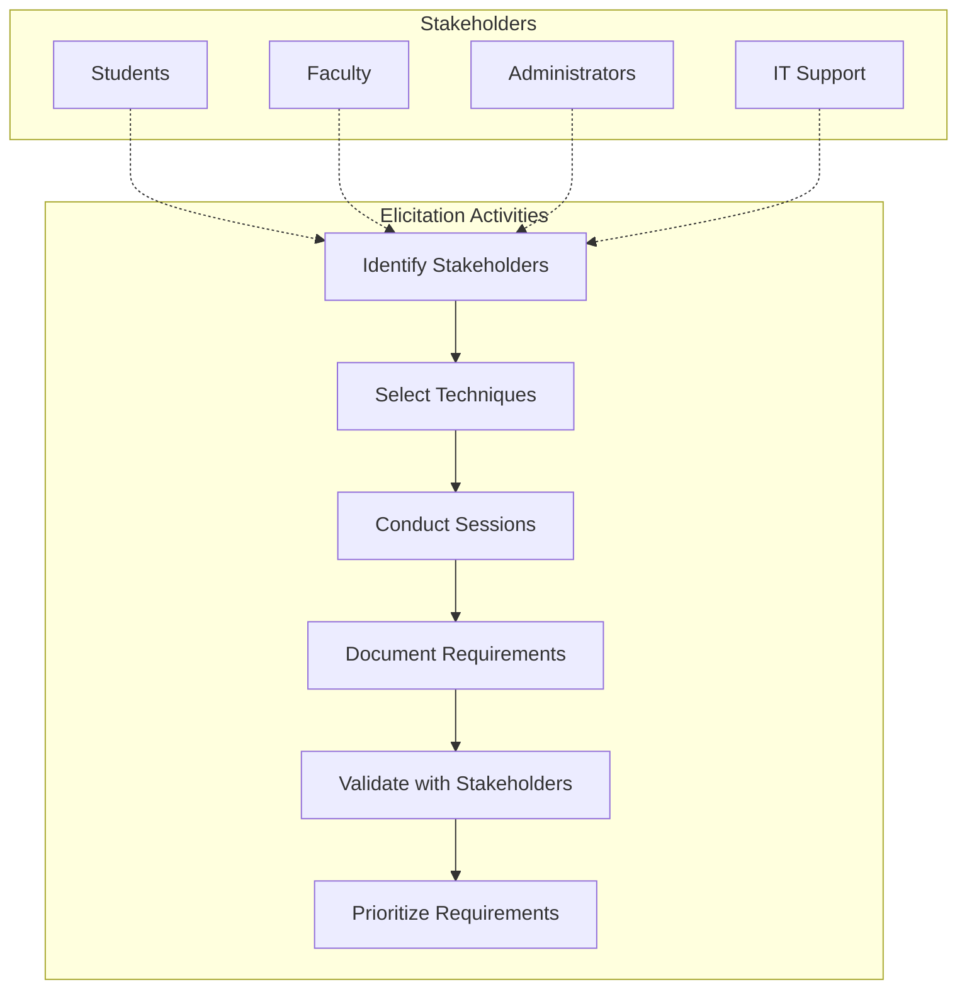
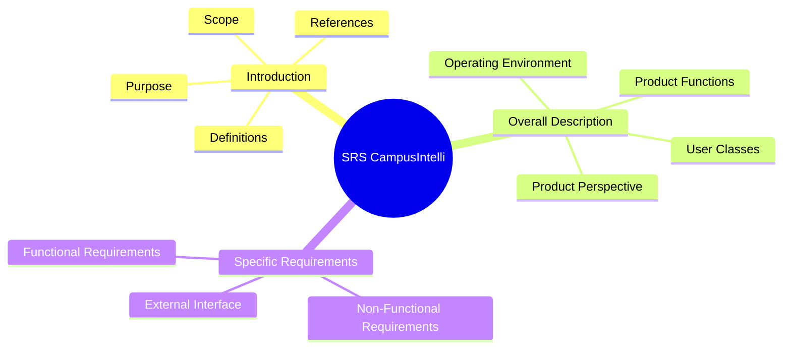
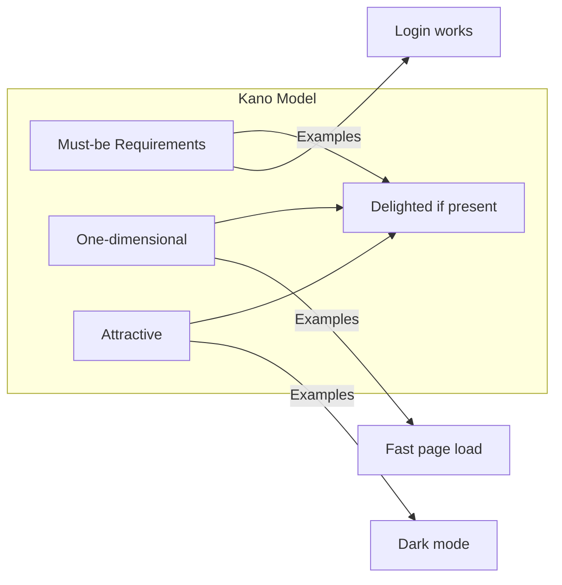

# Experiment 1: Requirement Elicitation Techniques and SRS Preparation

## Objective
To understand Requirement Elicitation Techniques and recognize types of requirements while preparing System Requirement Specification.

---

## 1. Understanding Requirement Elicitation

### What is Requirement Elicitation?
Requirement elicitation is the process of gathering requirements from stakeholders through various techniques to understand what the system should do.

### Elicitation Techniques

| Technique | Description | When to Use |
|-----------|-------------|-------------|
| **Interviews** | Direct conversation with stakeholders | Early stages, complex requirements |
| **Surveys/Questionnaires** | Structured questions to many stakeholders | Gathering diverse opinions |
| **Observation** | Watching users perform tasks | Understanding actual workflow |
| **Workshops** | Collaborative sessions with stakeholders | Resolving conflicts, brainstorming |
| **Prototyping** | Creating mockups for feedback | Visual requirements, UI/UX |
| **Document Analysis** | Reviewing existing documentation | Legacy systems, regulations |
| **Brainstorming** | Generating ideas freely | Initial requirement discovery |
| **JAD (Joint Application Development)** | Structured group sessions | Large projects, multiple stakeholders |

---

## 2. Types of Requirements

### Functional Requirements
Define **what** the system should do - specific behaviors and functions.

**CampusIntelli Examples:**
- System shall allow users to login with email and password
- System shall display weekly timetable for enrolled courses
- System shall allow students to upload assignment submissions
- System shall generate unique QR code for each lecture

### Non-Functional Requirements
Define **how well** the system performs - quality attributes.

**CampusIntelli Examples:**
- Page load time shall be less than 2 seconds
- System shall support 50+ concurrent users
- Passwords must be hashed before storage
- Interface must be responsive (mobile + desktop)

### Domain Requirements
Specific to the business domain - educational institution context.

**CampusIntelli Examples:**
- System shall follow academic calendar (semesters, exams)
- System shall support multiple departments
- System shall handle student enrollment cycles

---

## 3. Requirement Elicitation Process for CampusIntelli

---

## 4. Requirement Categories for CampusIntelli

| Category | Type | Examples |
|----------|------|----------|
| **Authentication** | Functional | Login, Logout, Session Management |
| **Academic** | Functional | Timetable, Assignments, Grades |
| **Attendance** | Functional | QR Generation, QR Scanning |
| **Campus Services** | Functional | Room Booking, Announcements |
| **Administration** | Functional | User Management, Reports |
| **Performance** | Non-Functional | <2s page load, 99.5% uptime |
| **Security** | Non-Functional | Password hashing, Role-based access |
| **Usability** | Non-Functional | Responsive design, Intuitive navigation |

---

## 5. SRS Document Structure (IEEE 830)

### CampusIntelli SRS Overview

---

## 6. Requirement Prioritization (Kano Model)

| Requirement Type | Description | CampusIntelli Example |
|-----------------|-------------|----------------------|
| **Must-be** | Basic expectations | User can login |
| **One-dimensional** | Directly impacts satisfaction | Fast page load |
| **Attractive** | Delightful surprises | AI-powered suggestions |

---

## 7. Practical Exercise

### Task 1: Identify Requirements
For CampusIntelli, list:
1. 3 Functional Requirements for Students
2. 3 Functional Requirements for Faculty
3. 3 Non-Functional Requirements

### Task 2: Classify Requirements
Categorize these requirements:
- "System shall send email notifications"
- "Page shall load in under 2 seconds"
- "Admin can delete user accounts"
- "System shall backup data daily"

### Task 3: Elicitation Technique Selection
Choose the best technique for:
- Understanding student attendance workflow
- Gathering feedback on new UI design
- Documenting compliance requirements

---

## 8. Summary

| Key Point | Description |
|-----------|-------------|
| Elicitation | Process of gathering requirements from stakeholders |
| Techniques | Interviews, surveys, workshops, prototyping, observation |
| Functional | What system does - behaviors and functions |
| Non-Functional | How system performs - quality attributes |
| SRS | IEEE 830 standard for documenting requirements |
| Prioritization | Using Kano model to categorize requirements |

---

**Experiment Completed**: [ ] Yes [ ] No  
**Date**: _____________  
**Signature**: _____________
