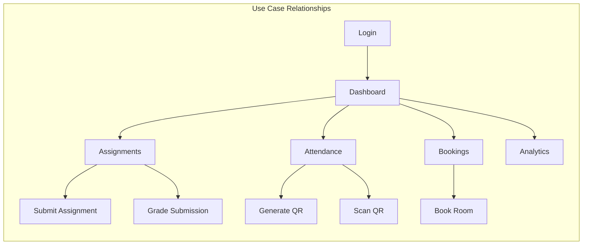

# Experiment 2: Functional Requirements, Actors, and Use Cases

## Objective
To identify functional requirements and prepare a list of Actors and Use Cases.

---

## 1. Understanding Functional Requirements

### Definition
Functional requirements specify **what** the system should do - the specific behaviors, functions, and services it must provide to users.

### Characteristics of Good Functional Requirements
- **Clear**: Unambiguous and specific
- **Testable**: Can be verified through testing
- **Complete**: Covers all expected functionality
- **Consistent**: No contradictions
- **Traceable**: Can be linked to business needs

---

## 2. Actors in CampusIntelli

### Primary Actors

| Actor | Description | Goals |
|-------|-------------|-------|
| **Student** | Enrolled student accessing academic resources | View courses, submit assignments, check grades, mark attendance |
| **Faculty** | Teaching staff managing courses | Create assignments, grade submissions, generate QR codes |
| **Admin** | System administrator | Manage users, configure system, generate reports |

### Secondary Actors

| Actor | Description | Role |
|-------|-------------|------|
| **System** | Automated processes | Notifications, QR expiry, data backup |
| **Email Service** | External service | Send notifications |
| **QR Scanner** | Device capability | Scan codes for attendance |

---

## 3. Use Case Identification

### Use Case Diagram for CampusIntelli

```mermaid
graph TB
    subgraph "CampusIntelli Portal"
        UC1[Login/Logout]
        UC2[View Dashboard]
        UC3[View Timetable]
        UC4[Submit Assignment]
        UC5[View Grades]
        UC6[Book Room/Equipment]
        UC7[View Announcements]
        UC8[Scan QR for Attendance]
        UC9[Create Assignment]
        UC10[Grade Submission]
        UC11[Generate QR Code]
        UC12[View Class Analytics]
        UC13[Upload Materials]
        UC14[Manage Users]
        UC15[Configure System]
        UC16[Generate Reports]
        UC17[Search Directory]
    end

    Student((Student))
    Faculty((Faculty))
    Admin((Admin))

    Student --> UC1
    Student --> UC2
    Student --> UC3
    Student --> UC4
    Student --> UC5
    Student --> UC6
    Student --> UC7
    Student --> UC8
    Student --> UC17

    Faculty --> UC1
    Faculty --> UC2
    Faculty --> UC3
    Faculty --> UC9
    Faculty --> UC10
    Faculty --> UC11
    Faculty --> UC12
    Faculty --> UC13
    Faculty --> UC6
    Faculty --> UC7
    Faculty --> UC17

    Admin --> UC1
    Admin --> UC2
    Admin --> UC14
    Admin --> UC15
    Admin --> UC16
```

---

## 4. Functional Requirements by Module

### Authentication Module

| ID | Requirement | Actor | Priority |
|----|-------------|-------|----------|
| FR-AUTH-01 | System shall allow users to login with email and password | All | High |
| FR-AUTH-02 | System shall validate user credentials against stored data | All | High |
| FR-AUTH-03 | System shall maintain user session for 24 hours | All | Medium |
| FR-AUTH-04 | System shall allow users to logout | All | High |
| FR-AUTH-05 | System shall redirect users based on role after login | All | High |

### Academic Module

| ID | Requirement | Actor | Priority |
|----|-------------|-------|----------|
| FR-ACAD-01 | System shall display weekly timetable for enrolled courses | Student, Faculty | High |
| FR-ACAD-02 | System shall allow faculty to create assignments with due dates | Faculty | High |
| FR-ACAD-03 | System shall allow students to upload assignment submissions | Student | High |
| FR-ACAD-04 | System shall allow faculty to grade submissions | Faculty | High |
| FR-ACAD-05 | System shall display gradebook with all course grades | Student | High |
| FR-ACAD-06 | System shall allow faculty to upload lecture materials | Faculty | Medium |

### Attendance Module

| ID | Requirement | Actor | Priority |
|----|-------------|-------|----------|
| FR-ATTD-01 | System shall generate unique QR code for each lecture | Faculty | High |
| FR-ATTD-02 | QR codes shall expire after 5 minutes | System | High |
| FR-ATTD-03 | System shall validate QR scan and mark attendance | Student | High |
| FR-ATTD-04 | System shall display attendance percentage per course | Student | Medium |
| FR-ATTD-05 | System shall prevent duplicate attendance marking | System | High |

### Booking Module

| ID | Requirement | Actor | Priority |
|----|-------------|-------|----------|
| FR-BOOK-01 | System shall display available rooms/equipment | All | High |
| FR-BOOK-02 | System shall allow users to book resources for specific time slots | All | High |
| FR-BOOK-03 | System shall prevent double-booking of resources | System | High |
| FR-BOOK-04 | System shall send booking confirmation | System | Medium |
| FR-BOOK-05 | System shall allow cancellation up to 2 hours before booking | All | Medium |

---

## 5. Use Case Summary Table

| Use Case | Actor | Description | Priority |
|----------|-------|-------------|----------|
| Login/Logout | Student, Faculty, Admin | User authenticates to access system | High |
| View Dashboard | All | User sees role-specific overview | High |
| View Timetable | Student, Faculty | User views weekly schedule | High |
| Submit Assignment | Student | Student uploads submission | High |
| View Grades | Student | Student checks grades | High |
| Book Room | Student, Faculty | User reserves campus resource | High |
| View Announcements | All | User reads campus news | Medium |
| Scan QR Attendance | Student | Student marks attendance | High |
| Create Assignment | Faculty | Faculty creates new assignment | High |
| Grade Submission | Faculty | Faculty grades student work | High |
| Generate QR Code | Faculty | Faculty creates attendance QR | High |
| View Analytics | Faculty, Admin | User views performance data | Medium |
| Upload Materials | Faculty | Faculty shares lecture content | Medium |
| Manage Users | Admin | Admin creates/edits users | High |
| Configure System | Admin | Admin adjusts settings | Low |
| Generate Reports | Admin | Admin creates reports | Medium |
| Search Directory | All | User searches campus contacts | Low |

---

## 6. Use Case Relationship Matrix

---

## 7. Practical Exercise

### Task 1: Identify Actors
List all actors for an Online Examination System and describe their goals.

### Task 2: Create Use Case List
For CampusIntelli, create a use case list with:
- Use Case Name
- Actor
- Brief Description
- Priority (High/Medium/Low)

### Task 3: Functional Requirements
Write 5 functional requirements for the Room Booking feature of CampusIntelli.

### Task 4: Use Case Diagram
Draw a use case diagram for the Assignment Submission feature showing:
- Student Actor
- Faculty Actor
- Submit Assignment Use Case
- Grade Submission Use Case
- View Grades Use Case

---

## 8. Summary

| Concept | Description |
|---------|-------------|
| Functional Requirement | What the system must do - specific behaviors |
| Actor | External entity interacting with the system |
| Use Case | Sequence of actions representing actor-system interaction |
| Primary Actor | Initiates the use case |
| Secondary Actor | Participates but doesn't initiate |
| Priority | Importance of the requirement/use case |

---

**Experiment Completed**: [ ] Yes [ ] No  
**Date**: _____________  
**Signature**: _____________
