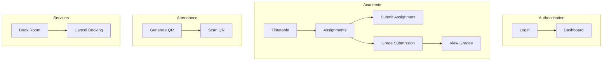

# Experiment 3: Use Case Specification Document

## Objective
To prepare Use Case Specification document or write use case scenarios.

---

## 1. Use Case Specification Template

### Standard Format

| Field | Description |
|-------|-------------|
| **Use Case ID** | Unique identifier (e.g., UC1, UC2) |
| **Name** | Descriptive name of the use case |
| **Actors** | Primary and secondary actors |
| **Description** | Brief summary of what the use case accomplishes |
| **Preconditions** | Conditions that must be true before starting |
| **Postconditions** | Conditions that are true after completion |
| **Main Flow** | Step-by-step primary sequence of events |
| **Alternative Flows** | Alternate paths and error conditions |
| **Extensions** | Points where other use cases can be triggered |
| **Priority** | High/Medium/Low |

---

## 2. Use Case Specifications for CampusIntelli

### UC1: Login/Logout

| Field | Description |
|-------|-------------|
| **Use Case ID** | UC1 |
| **Name** | Login/Logout |
| **Actors** | Student, Faculty, Admin |
| **Description** | User authenticates to access the system |
| **Preconditions** | User has valid credentials, account is active |
| **Postconditions** | User is authenticated and redirected to dashboard |

**Main Flow:**
1. User navigates to login page
2. User enters email and password
3. System validates credentials
4. System creates session token
5. System redirects user to role-based dashboard
6. User logs out when finished

**Alternative Flows:**
| Step | Condition | Action |
|------|-----------|--------|
| 3 | Invalid credentials | Display error message, return to step 2 |
| 3 | Account inactive | Display "Account disabled" message |
| 3 | Email not found | Display "User not found" message |

**Alternative Flow (Logout):**
1. User clicks logout button
2. System clears session
3. System redirects to login page

---

### UC4: Submit Assignment

| Field | Description |
|-------|-------------|
| **Use Case ID** | UC4 |
| **Name** | Submit Assignment |
| **Actors** | Student (Primary), System (Secondary) |
| **Description** | Student uploads assignment submission |
| **Preconditions** | Student is enrolled in course, assignment exists, before due date |
| **Postconditions** | Submission is recorded in system |

**Main Flow:**
1. Student navigates to Assignments page
2. System displays list of assignments
3. Student selects assignment to submit
4. System shows assignment details and due date
5. Student uploads file (PDF, DOC, DOCX, ZIP)
6. System validates file format and size
7. System saves file with unique name
8. System creates submission record with timestamp
9. System displays confirmation message

**Alternative Flows:**
| Step | Condition | Action |
|------|-----------|--------|
| 6 | Invalid format | Show error, return to step 5 |
| 6 | File too large (>10MB) | Show error, return to step 5 |
| 4 | Past due date | Mark as late submission, allow upload |
| 8 | Duplicate submission | Replace previous submission |

---

### UC8: Scan QR for Attendance

| Field | Description |
|-------|-------------|
| **Use Case ID** | UC8 |
| **Name** | Scan QR for Attendance |
| **Actors** | Student (Primary), System (Secondary) |
| **Description** | Student marks attendance by scanning faculty-generated QR |
| **Preconditions** | Faculty has generated QR, QR is not expired, student enrolled in course |
| **Postconditions** | Attendance marked for student in lecture |

**Main Flow:**
1. Student opens attendance scanner
2. Student activates camera
3. Student scans QR code displayed by faculty
4. System decodes QR data
5. System validates QR (not expired, student enrolled)
6. System checks for duplicate marking
7. System creates attendance record
8. System displays success message

**Alternative Flows:**
| Step | Condition | Action |
|------|-----------|--------|
| 5 | QR expired | Show "Code expired, contact faculty" |
| 6 | Already marked | Show "Already marked for this lecture" |
| 5 | Not enrolled | Show "Not enrolled in this course" |
| 5 | Invalid QR | Show "Invalid QR code" |

---

### UC11: Generate QR Code

| Field | Description |
|-------|-------------|
| **Use Case ID** | UC11 |
| **Name** | Generate QR Code |
| **Actors** | Faculty (Primary), System (Secondary) |
| **Description** | Faculty generates time-limited QR for attendance |
| **Preconditions** | Faculty is assigned to course/lecture |
| **Postconditions** | QR code displayed, expires in 5 minutes |

**Main Flow:**
1. Faculty navigates to attendance section
2. Faculty selects course and lecture
3. Faculty clicks "Generate QR" button
4. System creates unique code
5. System sets expiry time (5 minutes)
6. System saves QR record
7. System displays QR image with countdown timer
8. System invalidates previous QR for same lecture

---

### UC6: Book Room/Equipment

| Field | Description |
|-------|-------------|
| **Use Case ID** | UC6 |
| **Name** | Book Room/Equipment |
| **Actors** | Student, Faculty |
| **Description** | User reserves campus resource |
| **Preconditions** | Resource exists, time slot available |
| **Postconditions** | Booking confirmed, resource marked unavailable |

**Main Flow:**
1. User navigates to Booking page
2. User selects date and time slot
3. System displays available rooms
4. User selects preferred room
5. User enters booking purpose
6. User confirms booking
7. System validates no conflicts
8. System creates booking record
9. System sends confirmation email

**Alternative Flows:**
| Step | Condition | Action |
|------|-----------|--------|
| 3 | No rooms available | Show "No rooms available" message |
| 7 | Time slot taken | Show "Slot no longer available" |
| 6 | Max bookings reached | Show "Daily booking limit reached" |

---

### UC14: Manage Users

| Field | Description |
|-------|-------------|
| **Use Case ID** | UC14 |
| **Name** | Manage Users |
| **Actors** | Admin |
| **Description** | Admin creates, edits, or deletes user accounts |
| **Preconditions** | Admin is logged in |
| **Postconditions** | User record updated |

**Main Flow:**
1. Admin accesses User Management
2. Admin selects action (Create, Edit, Delete)
3. If Create/Edit: Admin enters/modifies user details
4. System validates email uniqueness
5. System hashes password
6. System saves user record
7. System sends welcome email

---

## 3. Use Case Priority Matrix

| Use Case | Priority | Sprint |
|----------|----------|--------|
| UC1: Login/Logout | High | Sprint 1 |
| UC2: View Dashboard | High | Sprint 1 |
| UC3: View Timetable | High | Sprint 2 |
| UC4: Submit Assignment | High | Sprint 2 |
| UC5: View Grades | High | Sprint 2 |
| UC6: Book Room | High | Sprint 3 |
| UC7: View Announcements | Medium | Sprint 3 |
| UC8: Scan QR Attendance | High | Sprint 4 |
| UC9: Create Assignment | High | Sprint 2 |
| UC10: Grade Submission | High | Sprint 2 |
| UC11: Generate QR Code | High | Sprint 4 |
| UC12: View Analytics | Medium | Sprint 4 |
| UC13: Upload Materials | Medium | Sprint 2 |
| UC14: Manage Users | High | Sprint 1 |
| UC15: Configure System | Low | Sprint 4 |
| UC16: Generate Reports | Medium | Sprint 4 |
| UC17: Search Directory | Low | Sprint 3 |

---

## 4. Use Case Relationship Diagram

---

## 5. Practical Exercise

### Task 1: Write Use Case Specification
Create a detailed use case specification for "View Grades" use case in CampusIntelli.

### Task 2: Alternative Flows
Write alternative flows for:
- Faculty generating QR code when course doesn't exist
- User booking a room that has maintenance scheduled

### Task 3: Use Case Diagram
Draw use case relationships showing:
- Login extends to role-based dashboard
- Submit Assignment includes file validation
- View Grades includes grade calculations

---

## 6. Summary

| Component | Description |
|-----------|-------------|
| Use Case ID | Unique identifier for tracking |
| Actors | Entities interacting with the system |
| Preconditions | State before use case begins |
| Postconditions | State after use case completes |
| Main Flow | Primary sequence of actions |
| Alternative Flows | Alternate paths and exceptions |
| Priority | Importance ranking |

---

**Experiment Completed**: [ ] Yes [ ] No  
**Date**: _____________  
**Signature**: _____________
