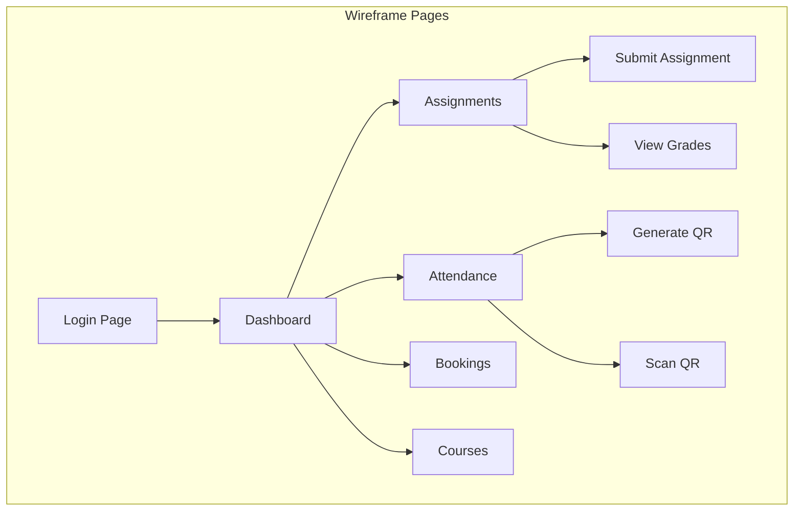

# Experiment 5: Wireframe Prototype for CampusIntelli

## Objective
To prepare prototype for the project using wireframe tools.

---

## 1. Understanding Wireframes

### What is a Wireframe?
A wireframe is a visual guide that represents the skeletal framework of a website or application.

### Types of Wireframes

| Type | Description | Use Case |
|------|-------------|----------|
| **Low-Fidelity** | Simple sketches, grayscale | Early concepts, brainstorming |
| **Mid-Fidelity** | Digital wireframes, basic UI elements | Design discussions |
| **High-Fidelity** | Detailed mockups,接近最终设计 | Client presentations, developer handoff |

### Wireframe Tools

| Tool | Type | Best For |
|------|------|----------|
| **Figma** | Cloud-based | Collaborative design |
| **Balsamiq** | Low-fidelity | Quick sketches |
| **Adobe XD** | Vector-based | Interactive prototypes |
| **Mockplus** | Simple wireframes | Rapid prototyping |
| **Pen & Paper** | Analog | Initial concepts |

---

## 2. CampusIntelli Wireframe Pages

### Page 1: Login Screen

```
┌─────────────────────────────────────────────────────────────────┐
│                                                                 │
│                         CampusIntelli                           │
│                    Smart Campus Portal                          │
│                                                                 │
│   ┌─────────────────────────────────────────────────────────┐   │
│   │                    LOGIN                                │   │
│   ├─────────────────────────────────────────────────────────┤   │
│   │   Email:     [student@campus.edu            ]           │   │
│   │                                                         │   │
│   │   Password:  [**********                      ]           │   │
│   │                                                         │   │
│   │   [x] Remember me                                         │   │
│   │                                                         │   │
│   │            [ LOGIN BUTTON ]                              │   │
│   │                                                         │   │
│   │   [ Register ]    [ Forgot Password? ]                   │   │
│   └─────────────────────────────────────────────────────────┘   │
│                                                                 │
│   Demo: student@campus.edu / student123                         │
│         faculty@campus.edu / faculty123                          │
│         admin@campus.edu / admin123                              │
│                                                                 │
└─────────────────────────────────────────────────────────────────┘
```

**Design Notes:**
- Clean, minimalist design
- Clear input fields with labels
- Prominent login button
- Demo credentials for testing
- Responsive for mobile devices

---

### Page 2: Student Dashboard

```
┌─────────────────────────────────────────────────────────────────┐
│  [☰] CampusIntelli     Welcome, John Doe (Student)    [⚙️][🚪] │
├─────────────────────────────────────────────────────────────────┤
│                                                                 │
│  Today's Schedule           Upcoming Deadlines                  │
│  ┌─────────────────┐        ┌─────────────────────────────┐    │
│  │ 09:00-10:00     │        │ Assignment 1 - CS101       │    │
│  │ CS101 - Room 201│        │ Due: Tomorrow, 11:59 PM    │    │
│  │                 │        │                            │    │
│  │ 10:00-11:00     │        │ Quiz 2 - CS201             │    │
│  │ CS201 - Lab 305 │        │ Due: Dec 20, 2024          │    │
│  │                 │        │                            │    │
│  │ 11:00-12:00     │        │ Project - SE401           │    │
│  │ SE401 - Room 105│        │ Due: Dec 25, 2024         │    │
│  └─────────────────┘        └─────────────────────────────┘    │
│                                                                 │
│  Quick Links                    Recent Announcements             │
│  ┌─────────────────┐        ┌─────────────────────────────┐    │
│  │ [📚 Courses]     │        │ Exam Schedule Published     │    │
│  │ [📝 Assignments]│        │ Dec 10, 2024 - Admin       │    │
│  │ [📅 Timetable]  │        │                            │    │
│  │ [🚪 Attendance] │        │ Holiday Notice             │    │
│  │ [📊 Grades]     │        │ Dec 15-17                   │    │
│  │ [🏢 Bookings]  │        │                            │    │
│  │ [📢 Announce]  │        │ Library Maintenance         │    │
│  └─────────────────┘        │ Dec 12                       │    │
│                             └─────────────────────────────┘    │
│                                                                 │
│  Stats: 5 Courses | 3 Pending | 87% Attendance                │
└─────────────────────────────────────────────────────────────────┘
```

---

### Page 3: Assignment Submission

```
┌─────────────────────────────────────────────────────────────────┐
│  [☰] CampusIntelli     Assignments - CS101             [👤] │
├─────────────────────────────────────────────────────────────────┤
│  > Courses > CS101 > Assignments                                    │
├─────────────────────────────────────────────────────────────────┤
│                                                                 │
│  ┌─────────────────────────────────────────────────────────────┐│
│  │ Assignment 3: Database Design Project                        ││
│  ├─────────────────────────────────────────────────────────────┤│
│  │ Due Date: December 15, 2024, 11:59 PM                      ││
│  │ Max Marks: 100                                             ││
│  │ Status: Open                                               ││
│  ├─────────────────────────────────────────────────────────────┤│
│  │ Description:                                               ││
│  │ Design a normalized database schema for a library...       ││
│  │                                                             ││
│  │ Attachments: requirements.pdf (245 KB)                     ││
│  ├─────────────────────────────────────────────────────────────┤│
│  │ Your Submission:                                          ││
│  │ ┌─────────────────────────────────────────────────────┐   ││
│  │ │ Drag & drop files here or click to browse          │   ││
│  │ │ [📁 Choose File]                                     │   ││
│  │ └─────────────────────────────────────────────────────┘   ││
│  │                                                             ││
│  │ Accepted formats: PDF, DOC, DOCX, ZIP (Max: 10MB)          ││
│  │                                                             ││
│  │                  [ SUBMIT ASSIGNMENT ]                     ││
│  │                                                             ││
│  │ Last Submission: Dec 10, 2024, 03:22 PM                    ││
│  └─────────────────────────────────────────────────────────────┘│
│                                                                 │
└─────────────────────────────────────────────────────────────────┘
```

---

### Page 4: QR Attendance

```
┌─────────────────────────────────────────────────────────────────┐
│  [☰] CampusIntelli     Mark Attendance                  [👤] │
├─────────────────────────────────────────────────────────────────┤
│  > Attendance > Mark                                             │
├─────────────────────────────────────────────────────────────────┤
│                                                                 │
│           ┌─────────────────────────────────────────┐           │
│           │                                         │           │
│           │         [ QR CODE DISPLAY ]            │           │
│           │                                         │           │
│           │     Scan this code to mark            │           │
│           │     your attendance                    │           │
│           │                                         │           │
│           │         ⏱ 04:59 remaining             │           │
│           │                                         │           │
│           │  Course: CS101 - Database Systems     │           │
│           │  Faculty: Dr. Smith                   │           │
│           │  Date: Dec 12, 2024                   │           │
│           │                                         │           │
│           └─────────────────────────────────────────┘           │
│                                                                 │
│                    [ 📷 OPEN SCANNER ]                           │
│                                                                 │
│  ┌─────────────────────────────────────────────────────────────┐ │
│  │ Recent Attendance                                         │ │
│  │ ┌─────────┬──────────────┬──────────┐                    │ │
│  │ │ Date    │ Status       │ Time     │                    │ │
│  │ ├─────────┼──────────────┼──────────┤                    │ │
│  │ │ Dec 12  │ ✓ Present    │ 09:15 AM │                    │ │
│  │ │ Dec 11  │ ✓ Present    │ 10:30 AM │                    │ │
│  │ │ Dec 10  │ ✗ Absent     │ -        │                    │ │
│  │ │ Dec 9   │ ✓ Present    │ 02:00 PM │                    │ │
│  │ └─────────┴──────────────┴──────────┘                    │ │
│  │ Overall Attendance: 87%                                  │ │
│  └─────────────────────────────────────────────────────────────┘ │
│                                                                 │
└─────────────────────────────────────────────────────────────────┘
```

---

### Page 5: Room Booking

```
┌─────────────────────────────────────────────────────────────────┐
│  [☰] CampusIntelli     Room Booking                      [👤] │
├─────────────────────────────────────────────────────────────────┤
│  > Services > Bookings                                              │
├─────────────────────────────────────────────────────────────────┤
│                                                                 │
│  Select Date:  [📅 Dec 12, 2024    ▼]                            │
│  Select Time:  [09:00 - 10:00  ▼]                                │
│                                                                 │
│  Available Rooms:                                                 │
│  ┌───────────┬─────────────┬─────────────┬─────────────────┐   │
│  │ Room      │ Capacity     │ Type        │ [ BOOK ]        │   │
│  ├───────────┼─────────────┼─────────────┼─────────────────┤   │
│  │ Room 101  │ 60 seats     │ Classroom   │ [ Book ]        │   │
│  │ Room 201  │ 30 seats     │ Classroom   │ [ Book ]        │   │
│  │ Lab 305   │ 25 seats     │ Computer Lab│ [ Book ]        │   │
│  │ Conf Room │ 12 seats     │ Meeting     │ [ Book ]        │   │
│  │ Auditori- │ 200 seats    │ Auditorium  │ [ Book ]        │   │
│  │ um A      │              │             │                 │   │
│  └───────────┴─────────────┴─────────────┴─────────────────┘   │
│                                                                 │
│  My Bookings:                                                    │
│  ┌────────────┬────────────┬───────────┬──────────────┐       │
│  │ Room       │ Date       │ Time      │ Status       │       │
│  ├────────────┼────────────┼───────────┼──────────────┤       │
│  │ Conf Room  │ Dec 13     │ 14:00-16:00│ [Cancel]     │       │
│  │ Lab 305    │ Dec 14     │ 10:00-12:00│ Confirmed    │       │
│  └────────────┴────────────┴───────────┴──────────────┘       │
│                                                                 │
└─────────────────────────────────────────────────────────────────┘
```

---

## 3. Wireframe Hierarchy



---

## 4. Key Design Principles

| Principle | Description | Application |
|-----------|-------------|-------------|
| **Consistency** | Same elements look/behave same | Navigation, buttons |
| **Hierarchy** | Clear visual priority | Headings, CTAs |
| **Feedback** | Response to user actions | Loading, success, error |
| **Affordance** | Intuitive controls | Clickable buttons, inputs |
| **Whitespace** | Breathing room | Readable content |

---

## 5. Practical Exercise

### Task 1: Sketch Wireframe
Create a low-fidelity wireframe for the Faculty Dashboard showing:
- Today's lectures
- Pending submissions to grade
- Generate QR button
- Recent announcements

### Task 2: Digital Wireframe
Using any wireframe tool (Figma, Balsamiq, or similar), create:
- Login page with proper layout
- Form validation states
- Error message display

### Task 3: Interactive Prototype
Add interactions to the wireframe:
- Click login → redirect to dashboard
- Hover effects on buttons
- Tab switching between login/register

---

## 6. Summary

| Concept | Description |
|---------|-------------|
| Wireframe | Skeletal visual guide of page structure |
| Low-Fidelity | Simple sketches, grayscale |
| High-Fidelity | Detailed,接近最终设计 |
| Prototype | Interactive wireframe with behaviors |
| User Flow | Path user takes through screens |

---

**Experiment Completed**: [ ] Yes [ ] No  
**Date**: _____________  
**Signature**: _____________
