# Experiment 6: Activity Diagram

## Objective
To draw activity diagram for the project.

---

## 1. Understanding Activity Diagrams

### What is an Activity Diagram?
An activity diagram is a behavioral diagram that models the flow of activities in a system, showing the sequence of actions and decision points.

### Key Components

| Symbol | Name | Description |
|--------|------|-------------|
| ⬭ | Initial Node | Start of the flow |
| ◉ | Final Node | End of the flow |
| ▭ | Activity | Action being performed |
| ◇ | Decision | Branching point |
| ▷ | Control Flow | Arrow showing direction |
| ║ | Swinmlane | Groups activities by actor |

---

## 2. Activity Diagram: Assignment Submission

---

## 3. Activity Diagram: QR Attendance Marking

```mermaid
flowchart TB
    subgraph Faculty["👨‍🏫 Faculty"]
        F1[Start Lecture]
        F2[Generate QR Code]
        F3[Display QR to Class]
        F4[Monitor Attendance]
    end

    subgraph System["⚙️ System"]
        SY1[Create Unique QR]
        SY2[Set 5-min Expiry]
        SY3[Display Countdown]
        SY4{QR Expired?}
        SY5[Invalidate QR]
        SY6[Validate QR Scan]
        SY7{Valid?}
        SY8[Check Duplicate]
        SY9{Already Marked?}
        SY10[Record Attendance]
        SY11[Send Confirmation]
        SY12[Show Error: Expired]
        SY13[Show Error: Duplicate]
    end

    subgraph Student["🎓 Student"]
        S1[Open Scanner]
        S2[Scan QR Code]
        S3[View Confirmation]
    end

    F1 --> F2
    F2 --> SY1
    SY1 --> SY2
    SY2 --> SY3
    SY3 --> F3
    F3 --> SY4
    SY4 -->|Yes| SY5
    SY4 -->|No| S1
    S1 --> S2
    S2 --> SY6
    SY6 --> SY7
    SY7 -->|No| SY12
    SY7 -->|Yes| SY8
    SY8 --> SY9
    SY9 -->|Yes| SY13
    SY9 -->|No| SY10
    SY10 --> SY11
    SY11 --> S3
    S3 --> F4
```

---

## 4. Activity Diagram: Room Booking

---

## 5. Activity Diagram: Grading Flow

---

## 6. Activity Diagram: Login Flow

```mermaid
flowchart TB
    subgraph User["👤 User"]
        U1[Open Login Page]
        U2[Enter Credentials]
        U3[Click Login]
        U4[View Dashboard]
    end

    subgraph System["⚙️ System"]
        SY1[Validate Input]
        SY2{Input Valid?}
        SY3[Find User by Email]
        SY4{User Exists?}
        SY5[Verify Password]
        SY6{Password Correct?}
        SY7[Create Session]
        SY8[Log Login Time]
        SY9[Redirect by Role]
        SY10[Show Error: Invalid Input]
        SY11[Show Error: User Not Found]
        SY12[Show Error: Wrong Password]
    end

    U1 --> U2
    U2 --> U3
    U3 --> SY1
    SY1 --> SY2
    SY2 -->|No| SY10
    SY10 --> U2
    SY2 -->|Yes| SY3
    SY3 --> SY4
    SY4 -->|No| SY11
    SY11 --> U2
    SY4 -->|Yes| SY5
    SY5 --> SY6
    SY6 -->|No| SY12
    SY12 --> U2
    SY6 -->|Yes| SY7
    SY7 --> SY8
    SY8 --> SY9
    SY9 --> U4
```

---

## 7. Activity Diagram: User Registration (Admin)

---

## 8. Activity Summary Table

| Process | Actors | Key Decisions |
|---------|--------|---------------|
| Assignment Submission | Student, System | File validation, due date check |
| QR Attendance | Faculty, Student, System | QR validity, duplicate check |
| Room Booking | User, System | Availability, conflict check |
| Grading | Faculty, Student, System | Marks validation |
| User Registration | Admin, System | Email uniqueness, field validation |
| Login | User, System | Credentials verification |

---

## 9. Practical Exercise

### Task 1: Draw Activity Diagram
Create an activity diagram for the "Cancel Booking" use case.

### Task 2: Identify Decision Points
For the Grade Submission flow, identify all decision points and their conditions.

### Task 3: Add Swimlanes
Add swimlanes to the QR Attendance diagram showing:
- Faculty activities
- Student activities
- System activities

---

## 10. Summary

| Concept | Description |
|---------|-------------|
| Activity Diagram | Behavioral diagram showing flow of activities |
| Initial Node | Start of the activity flow |
| Final Node | End of the activity flow |
| Activity | Atomic action being performed |
| Decision | Branching point with conditions |
| Control Flow | Arrow showing direction of flow |
| Swimlane | Groups activities by actor |

---

**Experiment Completed**: [ ] Yes [ ] No  
**Date**: _____________  
**Signature**: _____________
