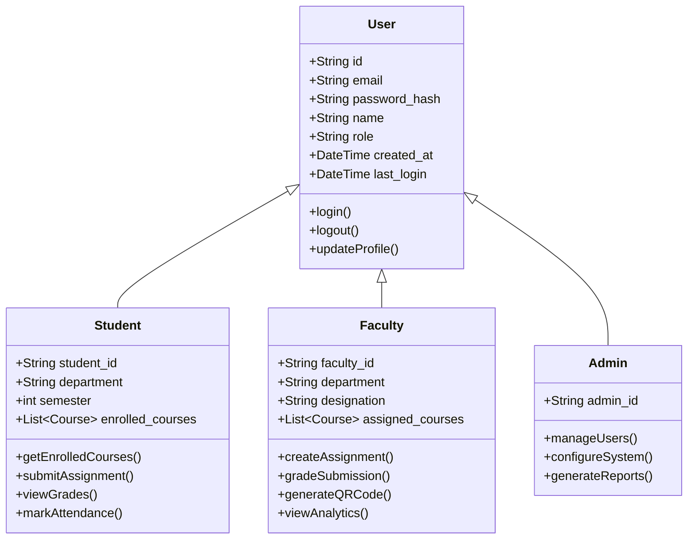
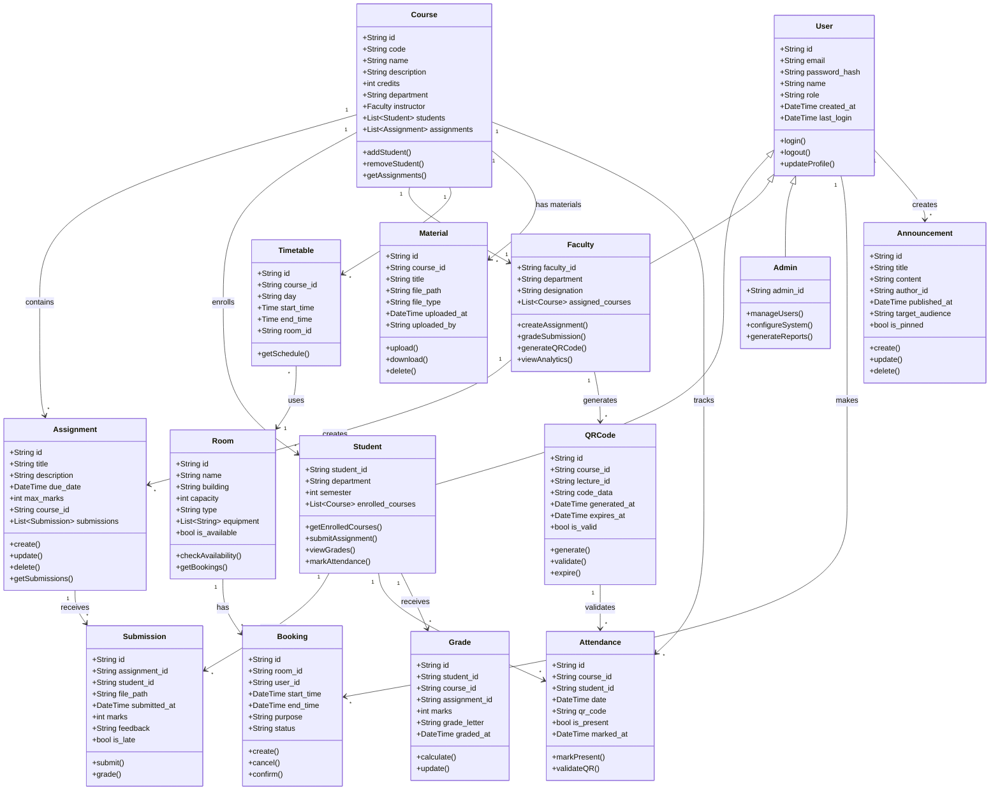

# Experiment 7: Analytical Classes and Class Diagram

## Objective
To identify analytical classes and prepare class diagram.

---

## 1. Understanding Class Diagrams

### What is a Class Diagram?
A class diagram is a structural diagram that shows the classes, their attributes, methods, and relationships in a system.

### Class Notation

```
┌───────────────────────────────────────┐
│           Class Name                  │
├───────────────────────────────────────┤
│  - privateAttribute: Type             │
│  # protectedAttribute: Type           │
│  + publicAttribute: Type              │
├───────────────────────────────────────┤
│  + publicMethod(): ReturnType         │
│  # protectedMethod(): ReturnType      │
│  - privateMethod(): ReturnType        │
└───────────────────────────────────────┘
```

### Relationship Types

| Symbol | Relationship | Description |
|--------|--------------|-------------|
| ──█ | Inheritance | A is-a B |
| ──◇ | Composition | A owns B (strong) |
| ──◇ | Aggregation | A has B (weak) |
| ──▷ | Association | A knows B |
| ──▷ | Realization | A implements B |

---

## 2. Analytical Classes for CampusIntelli

### User Class Hierarchy



---

## 3. Complete Class Diagram



---

## 4. Class Specifications

### User (Abstract Base Class)

| Attribute | Type | Description |
|-----------|------|-------------|
| id | String | Unique identifier (UUID) |
| email | String | User email (unique) |
| password_hash | String | Bcrypt hashed password |
| name | String | Full name |
| role | String | "student", "faculty", "admin" |
| created_at | DateTime | Account creation timestamp |
| last_login | DateTime | Last login timestamp |

| Method | Returns | Description |
|--------|---------|-------------|
| login() | bool | Authenticate user |
| logout() | void | End session |
| updateProfile() | bool | Update user details |

---

### Course

| Attribute | Type | Description |
|-----------|------|-------------|
| id | String | Unique identifier |
| code | String | Course code (e.g., "CS101") |
| name | String | Course title |
| description | String | Course description |
| credits | int | Credit hours |
| department | String | Department name |
| instructor | Faculty | Assigned faculty |
| students | List[Student] | Enrolled students |
| assignments | List[Assignment] | Course assignments |

---

### Assignment

| Attribute | Type | Description |
|-----------|------|-------------|
| id | String | Unique identifier |
| title | String | Assignment title |
| description | String | Instructions |
| due_date | DateTime | Submission deadline |
| max_marks | int | Maximum marks |
| course_id | String | Parent course reference |
| submissions | List[Submission] | Student submissions |

---

### Booking

| Attribute | Type | Description |
|-----------|------|-------------|
| id | String | Unique identifier |
| room_id | String | Room reference |
| user_id | String | Booker reference |
| start_time | DateTime | Booking start |
| end_time | DateTime | Booking end |
| purpose | String | Booking reason |
| status | String | "pending", "confirmed", "cancelled" |

---

### QRCode

| Attribute | Type | Description |
|-----------|------|-------------|
| id | String | Unique identifier |
| course_id | String | Course reference |
| lecture_id | String | Lecture reference |
| code_data | String | Encoded QR data |
| generated_at | DateTime | Generation timestamp |
| expires_at | DateTime | Expiry timestamp (5 min) |
| is_valid | bool | Validity status |

---

## 5. Relationships Summary

| Relationship | Type | Description |
|--------------|------|-------------|
| User ↔ Student/Faculty/Admin | Inheritance | Role-based specialization |
| Course ↔ Assignment | Composition | Course contains assignments |
| Course ↔ Student | Association | Many-to-many enrollment |
| Assignment ↔ Submission | Composition | Assignment has submissions |
| Room ↔ Booking | Composition | Room has bookings |
| QRCode ↔ Attendance | Association | QR validates attendance |

---

## 6. Practical Exercise

### Task 1: Identify Classes
Identify the analytical classes for an Online Library System.

### Task 2: Draw Class Diagram
Draw a class diagram showing:
- Book class
- Member class
- Loan class
- Librarian class
- Appropriate relationships

### Task 3: Add Methods
Add relevant methods to the Room and Booking classes.

---

## 7. Summary

| Concept | Description |
|---------|-------------|
| Class Diagram | Structural diagram showing classes and relationships |
| Class | Blueprint for objects with attributes and methods |
| Attribute | Data fields of a class |
| Method | Functions/behaviors of a class |
| Inheritance | "is-a" relationship between classes |
| Composition | Strong "has-a" relationship |
| Association | Connection between classes |

---

**Experiment Completed**: [ ] Yes [ ] No  
**Date**: _____________  
**Signature**: _____________
