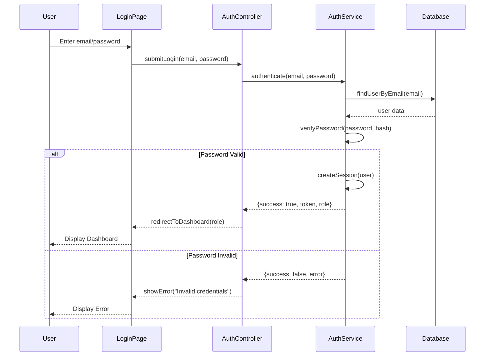
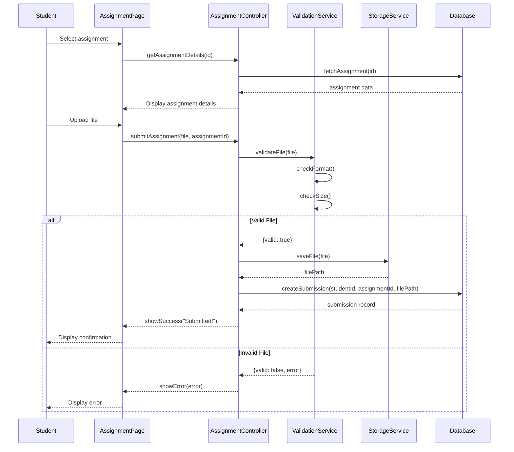
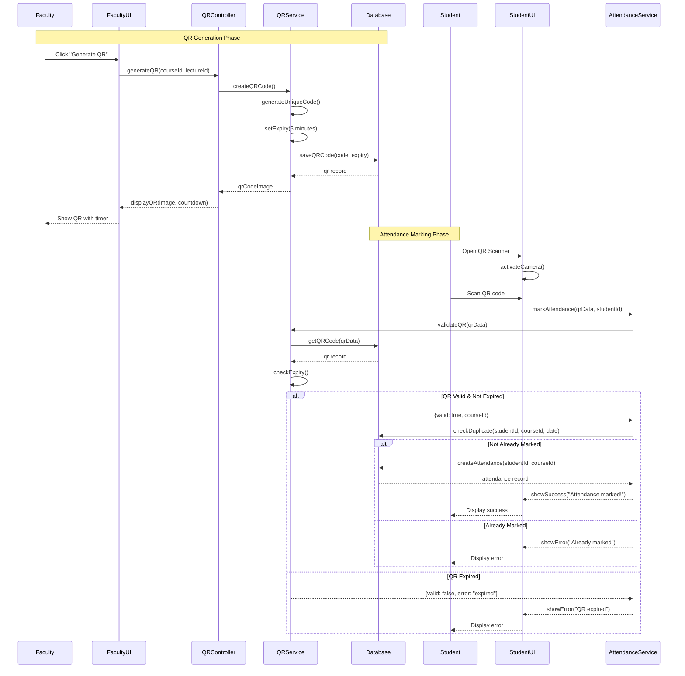
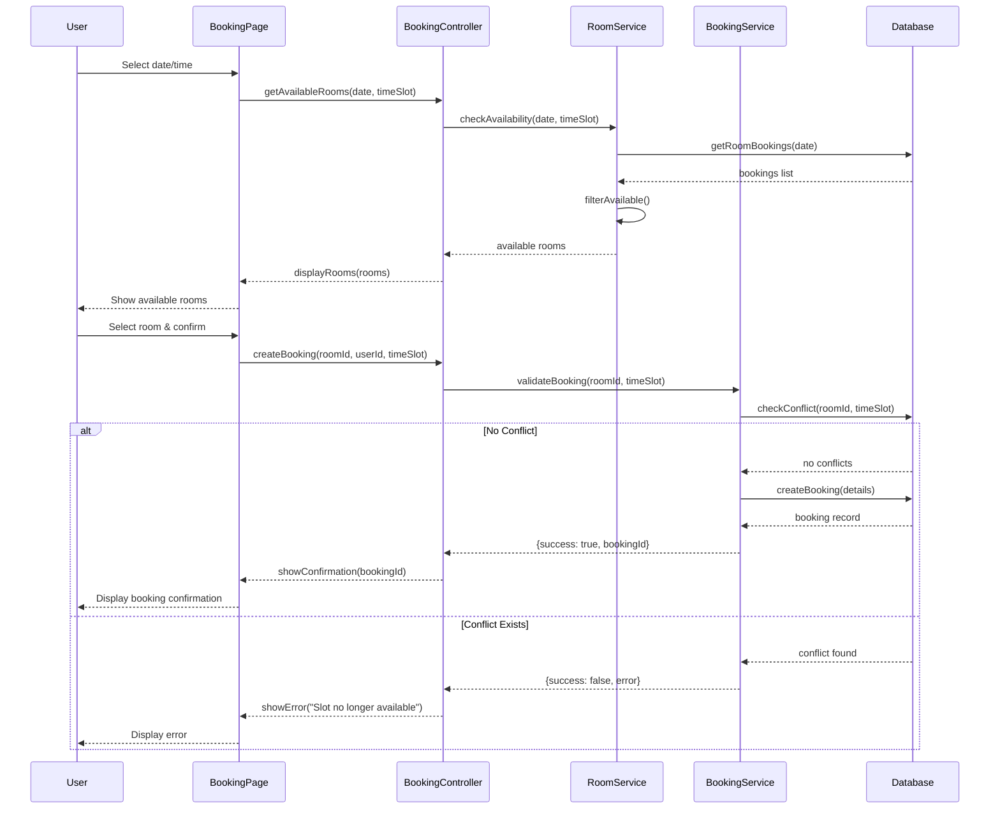
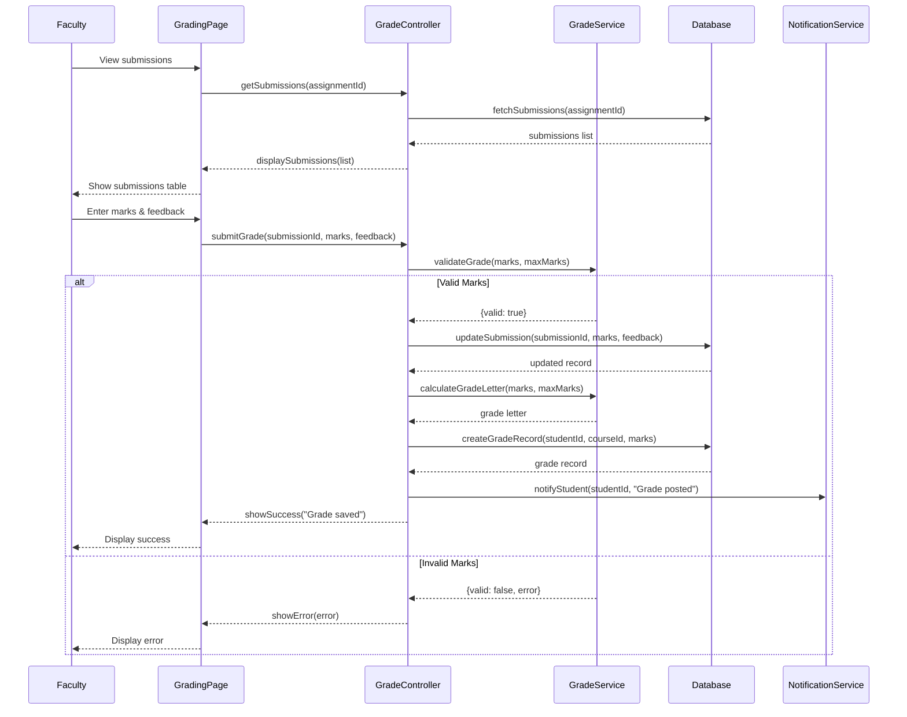
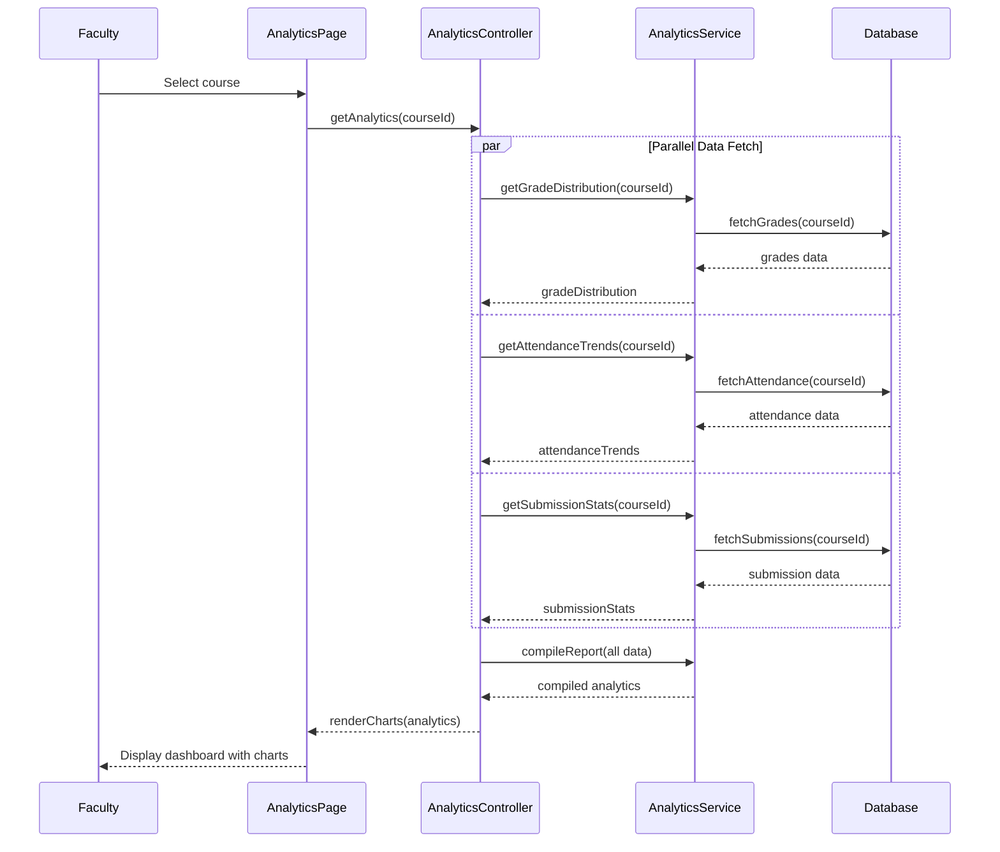

# Experiment 8: Analytical Sequence Diagram

## Objective
To prepare analytical sequence diagram.

---

## 1. Understanding Sequence Diagrams

### What is a Sequence Diagram?
A sequence diagram is an interaction diagram that shows how objects interact in a particular scenario, emphasizing the chronological order of messages.

### Key Components

| Symbol | Name | Description |
|--------|------|-------------|
| ▭ | Lifeline | Vertical line representing object existence |
| ▽ | Message | Arrow showing communication |
| ⬜ | Activation | Rectangle showing method execution |
| ∥∥ | Alt | Alternative paths (if-else) |
| ∗∗ | Loop | Repeated execution |

### Message Types

| Type | Syntax | Description |
|------|--------|-------------|
| Synchronous | ──▷ | Caller waits for response |
| Asynchronous | ──▷ | Caller continues without waiting |
| Return | ──▷ | Response to a message |
| Self | ──▷ | Object calls itself |

---

## 2. Sequence Diagram: User Login

---

## 3. Sequence Diagram: Assignment Submission

---

## 4. Sequence Diagram: QR Attendance Marking

---

## 5. Sequence Diagram: Room Booking

---

## 6. Sequence Diagram: Grade Submission

---

## 7. Sequence Diagram: View Analytics

---

## 8. Key Patterns Used

| Pattern | Usage | Example |
|---------|-------|---------|
| **Controller** | Handles requests, coordinates services | AuthController, GradeController |
| **Service** | Business logic and validation | AuthService, GradeService |
| **Repository** | Data access abstraction | Database operations |
| **Parallel Processing** | Analytics data fetching | Multiple data fetches simultaneously |
| **Alternative Flows** | Error handling paths | Password invalid, duplicate attendance |

---

## 9. Practical Exercise

### Task 1: Draw Sequence Diagram
Create a sequence diagram for the "Cancel Booking" use case.

### Task 2: Identify Messages
For the User Login sequence, list all messages exchanged between objects.

### Task 3: Add Alternative Flows
Add alternative flow handling to the Room Booking sequence for:
- No available rooms
- User cancellation before confirmation

---

## 10. Summary

| Concept | Description |
|---------|-------------|
| Sequence Diagram | Interaction diagram showing message sequence |
| Lifeline | Vertical line representing object existence |
| Message | Communication between objects |
| Synchronous | Caller waits for response |
| Asynchronous | Caller continues without waiting |
| Alt | Alternative paths (if-else conditions) |
| Loop | Repeated message exchanges |

---

**Experiment Completed**: [ ] Yes [ ] No  
**Date**: _____________  
**Signature**: _____________
