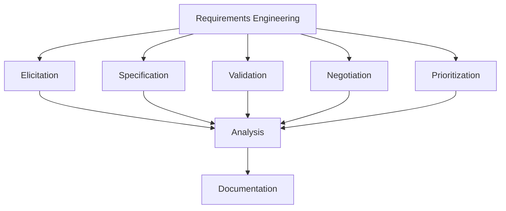
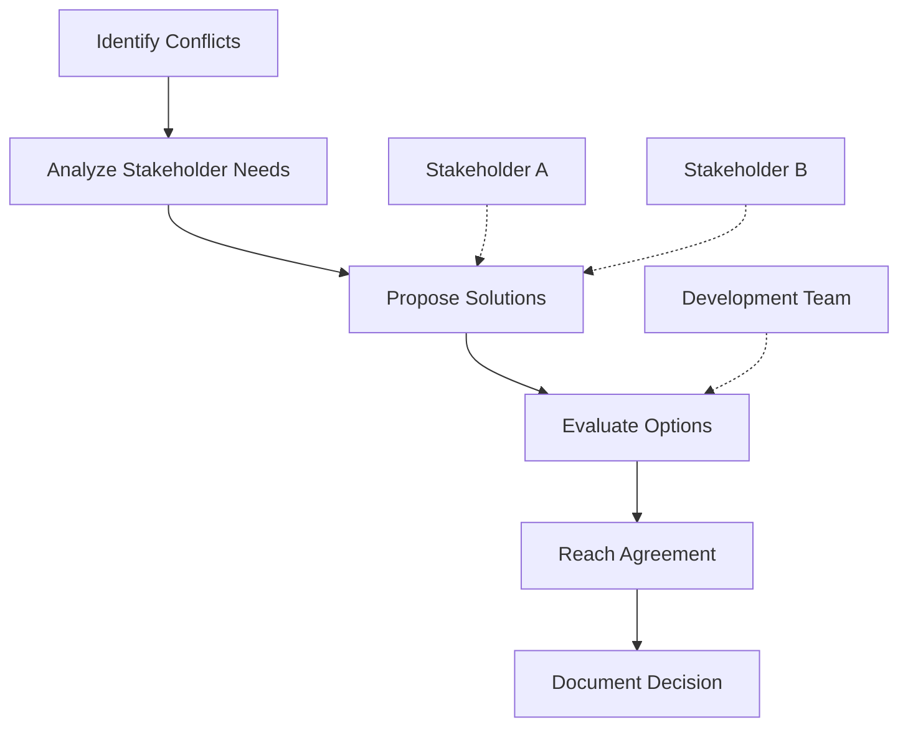
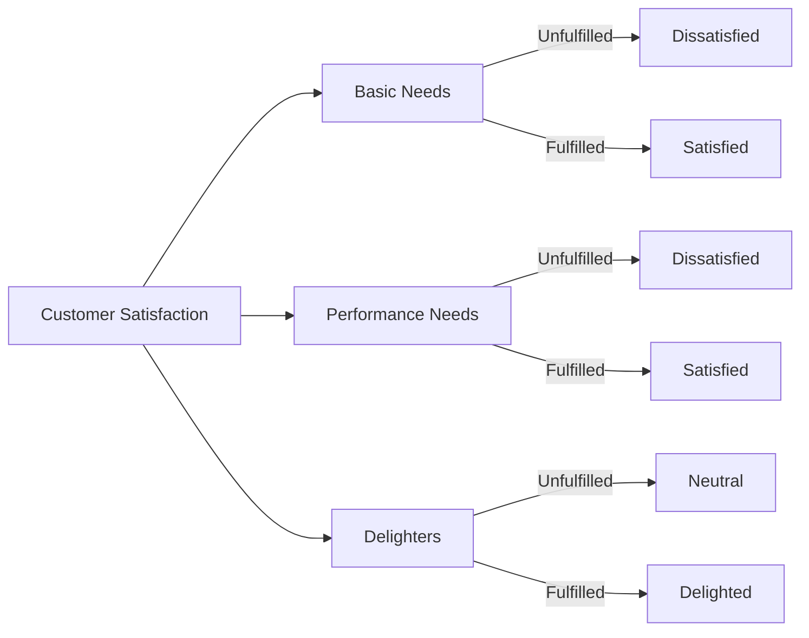
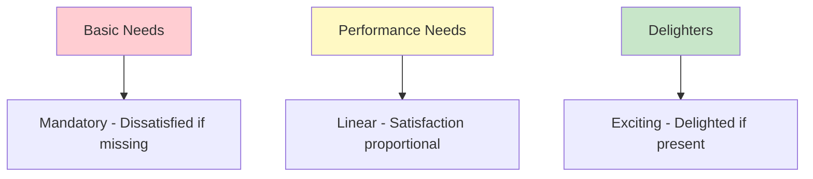
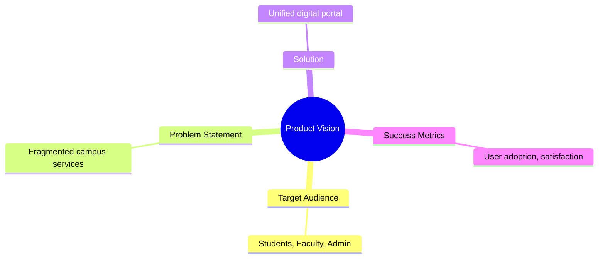
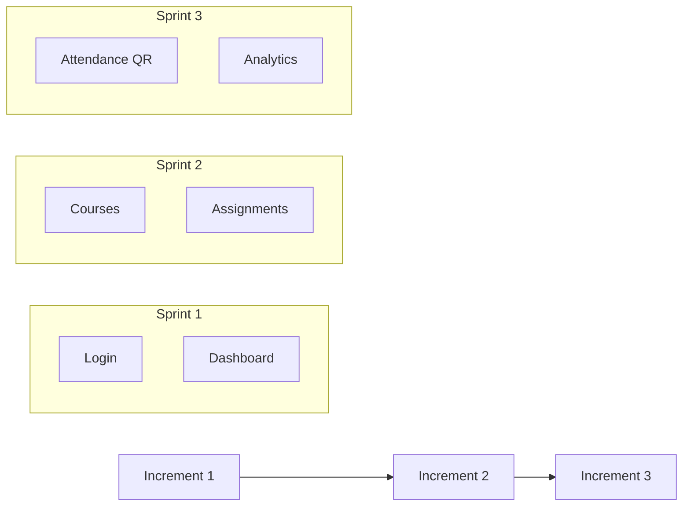
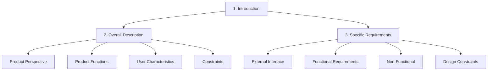

# Unit III: Requirements Engineering & Analysis

**Duration**: 5 hours

---

## 1. Requirements Engineering Process

### Overview



---

## 2. Requirements Elicitation

### Techniques

| Technique | Description | Advantages | Disadvantages |
|-----------|-------------|------------|--------------|
| **Interviews** | Direct conversation | In-depth insights | Time-consuming |
| **Surveys** | Questionnaires | Wide reach | Surface-level |
| **Workshops** | Group sessions | Collaborative | Logistically complex |
| **Observation** | Watch users work | Real behavior | Intrusive |
| **Prototyping** | Mockup feedback | Visual requirements | Costly |
| **Document Analysis** | Review existing docs | Context understanding | May be outdated |

---

## 3. Requirements Specification

### Types of Requirements

#### Functional Requirements
Define **what** the system does.

**Format:**
> System shall [function] [by/when/if] [condition]

**Example:**
> The system shall allow students to submit assignments before the due date.

#### Non-Functional Requirements
Define **how well** the system performs.

| Category | Example |
|----------|---------|
| **Performance** | Page load < 2 seconds |
| **Security** | Passwords hashed with bcrypt |
| **Usability** | 3 clicks to any feature |
| **Reliability** | 99.5% uptime |
| **Scalability** | Support 1000 concurrent users |

---

## 4. Requirements Validation

### Checklist

| Check | Description |
|-------|-------------|
| **Completeness** | All requirements documented? |
| **Consistency** | No contradictory requirements? |
| **Clarity** | Unambiguous language? |
| **Testability** | Can be verified? |
| **Traceability** | Linked to sources? |
| **Feasibility** | Technically possible? |

---

## 5. Requirements Negotiation

### Process



---

## 6. Requirements Prioritization

### MoSCoW Method

| Priority | Meaning | Description |
|----------|---------|-------------|
| **Must Have** | Critical | Essential for release |
| **Should Have** | Important | Significant value |
| **Could Have** | Desirable | Nice to have |
| **Won't Have** | Future | Not for this release |

---

## 7. Kano Model

### Concept



### Kano Diagram



| Category | Description | Example |
|----------|-------------|---------|
| **Must-be** | Basic expectations | User can login |
| **One-dimensional** | Direct satisfaction | Fast page loads |
| **Attractive** | Delightful surprises | Dark mode theme |

---

## 8. Agile Requirements Analysis

### Agile vs Traditional

| Aspect | Traditional | Agile |
|--------|-------------|-------|
| Approach | Big upfront analysis | Iterative refinement |
| Documentation | Comprehensive SRS | Just enough |
| Change | Resist | Embrace |
| Customer | Periodic reviews | Continuous collaboration |

---

## 9. Agile Requirements Concepts

### Product Vision



### Business Goals

| Goal | Metric |
|------|--------|
| Reduce administrative overhead | 50% less time |
| Improve student satisfaction | 4+ rating |
| Increase attendance tracking | 95% coverage |

---

### Incremental Requirements



---

### Value-Driven Development

| Value Type | Description | Priority |
|------------|-------------|----------|
| **Business Value** | Revenue, efficiency | High |
| **User Value** | Satisfaction, productivity | High |
| **Technical Value** | Maintainability, extensibility | Medium |

---

## 10. Agile Requirement Artifacts

### Product Backlog

| Item | Description | Priority |
|------|-------------|----------|
| US-001 | User login | Must |
| US-002 | Dashboard | Must |
| US-003 | Course listing | Must |

### User Story

```markdown
As a [role],
I want to [goal],
So that [benefit]
```

### Acceptance Criteria

```markdown
Given [context]
When [action]
Then [outcome]
```

---

## 11. Roles and Responsibilities

| Role | Requirements Responsibility |
|------|----------------------------|
| **Product Owner** | Prioritize, clarify, validate |
| **Scrum Master** | Facilitate, remove impediments |
| **Development Team** | Analyze, estimate, implement |
| **Stakeholders** | Provide feedback, validate |

---

## 12. Software Requirement Specification (SRS)

### IEEE SRS Structure



---

### SRS Sections

#### 1. Introduction

| Subsection | Content |
|------------|---------|
| Purpose | What the SRS describes |
| Scope | What the system does/doesn't do |
| Definitions | Key terms, acronyms |
| References | Related documents |

#### 2. Overall Description

| Subsection | Content |
|------------|---------|
| Product Perspective | System context |
| Product Functions | Summary of functions |
| User Classes | User types and characteristics |
| Operating Environment | Hardware, software requirements |
| Design Constraints | Standards, limitations |

#### 3. Specific Requirements

| Subsection | Content |
|------------|---------|
| External Interfaces | UI, hardware, software interfaces |
| Functional Requirements | System behaviors |
| Non-Functional Requirements | Performance, security, reliability |
| Design Constraints | Implementation requirements |

---

## 13. Characteristics of Good SRS

| Characteristic | Description |
|----------------|-------------|
| **Correct** | Accurately represents requirements |
| **Unambiguous** | Single interpretation |
| **Complete** | All requirements included |
| **Consistent** | No contradictions |
| **Ranked** | Priority specified |
| **Verifiable** | Can be tested |
| **Modifiable** | Easy to change |
| **Traceable** | Links to design, code |

---

## 14. Summary

| Topic | Key Points |
|-------|------------|
| Requirements Elicitation | Techniques: interviews, surveys, workshops |
| Requirements Types | Functional, non-functional, domain |
| Validation | Completeness, consistency, testability |
| Prioritization | MoSCoW, Kano model |
| SRS | IEEE 830 standard structure |

---

## 15. Practical Exercise

### Questions
1. List three requirements elicitation techniques and their advantages.
2. Explain the difference between functional and non-functional requirements.
3. What is the Kano model and how is it used for prioritization?
4. Describe the IEEE 830 SRS structure.
5. What are the characteristics of a good SRS?

### Assignment
Write 5 functional requirements and 3 non-functional requirements for CampusIntelli's attendance system.

---

**Unit Completed**: [ ] Yes [ ] No  
**Date**: _____________  
**Signature**: _____________
