# Unit II: Agile Development

**Duration**: 5 hours

---

## 1. Introduction to Agile Development

### The Need for Agile

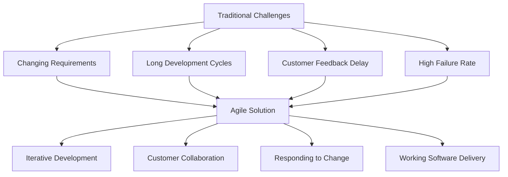

---

## 2. Agile Manifesto

### The Four Values

> **Individuals and interactions** over processes and tools  
> **Working software** over comprehensive documentation  
> **Customer collaboration** over contract negotiation  
> **Responding to change** over following a plan

### Principles Behind the Agile Manifesto

| # | Principle |
|---|-----------|
| 1 | Our highest priority is to satisfy the customer through early and continuous delivery of valuable software. |
| 2 | Welcome changing requirements, even late in development. |
| 3 | Deliver working software frequently, from a couple of weeks to a couple of months. |
| 4 | Business people and developers must work together daily throughout the project. |
| 5 | Build projects around motivated individuals. Give them the environment and support they need. |
| 6 | The most efficient and effective method of conveying information is face-to-face conversation. |
| 7 | Working software is the primary measure of progress. |
| 8 | Agile processes promote sustainable development. |
| 9 | Continuous attention to technical excellence and good design enhances agility. |
| 10 | Simplicity—the art of maximizing the amount of work not done—is essential. |
| 11 | The best architectures, requirements, and designs emerge from self-organizing teams. |
| 12 | At regular intervals, the team reflects on how to become more effective. |

---

## 3. Agility and Cost of Change

### Cost of Change Curve

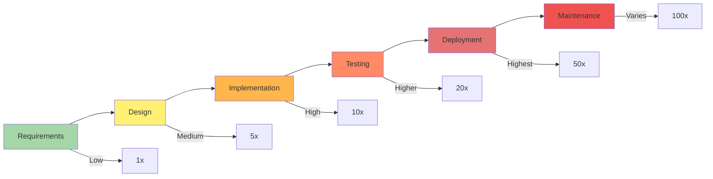

### Traditional vs Agile Cost Models

| Aspect | Traditional | Agile |
|--------|-------------|-------|
| Change Cost | Increases exponentially | Remains relatively flat |
| Requirements | Fixed upfront | Evolving |
| Feedback | Late in cycle | Continuous |
| Adaptability | Low | High |

---

## 4. Agility Principles

### The 12 Agile Principles

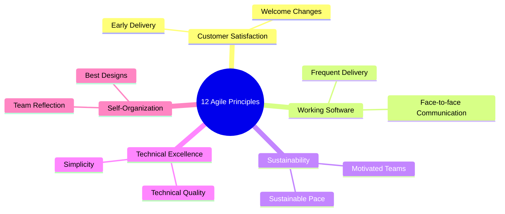

---

## 5. Myth of Planned Development

### The Fallacy of Complete Planning

| Myth | Reality |
|------|---------|
| "All requirements can be known upfront" | Users don't know what they want until they see working software |
| "Detailed plans predict the future" | Uncertainty cannot be completely eliminated |
| "Changes are disruptions" | Changes bring valuable learning |
| "Big upfront design is efficient" | YAGNI - You Aren't Gonna Need It |

### The Uncertainty Cone

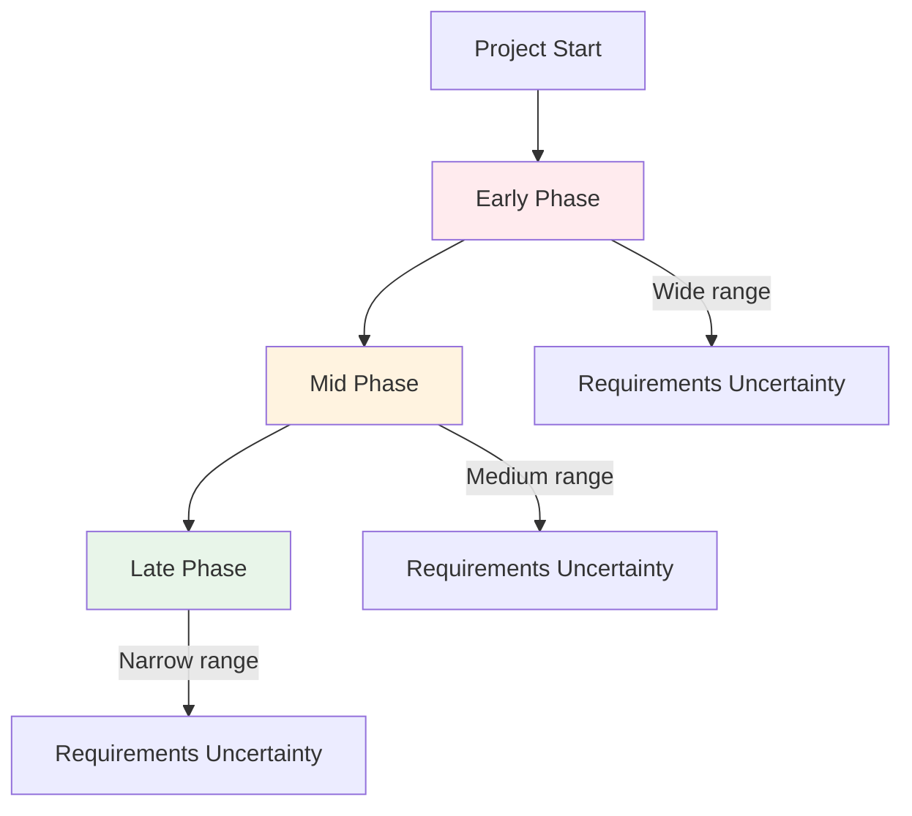

---

## 6. Toolset for Agile Process

### Essential Agile Tools

| Category | Tools | Purpose |
|----------|-------|---------|
| **Project Management** | Jira, Trello, Azure Boards | Sprint planning, backlog management |
| **Communication** | Slack, Microsoft Teams | Daily collaboration |
| **Version Control** | Git, GitHub, GitLab | Code management |
| **CI/CD** | Jenkins, GitHub Actions | Automated deployment |
| **Testing** | Selenium, JUnit | Automated testing |
| **Documentation** | Confluence, Notion | Knowledge sharing |

---

## 7. Extreme Programming (XP)

### XP Values

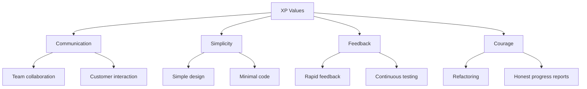

| Value | Description | Practice |
|-------|-------------|----------|
| **Communication** | Face-to-face, reduce documentation | Planning game, stand-ups |
| **Simplicity** | Design for today, not tomorrow | Simple design, metaphor |
| **Feedback** | Rapid, continuous feedback | Test-driven development |
| **Courage** | Face reality, make changes | Refactoring, collective ownership |

---

### XP Process

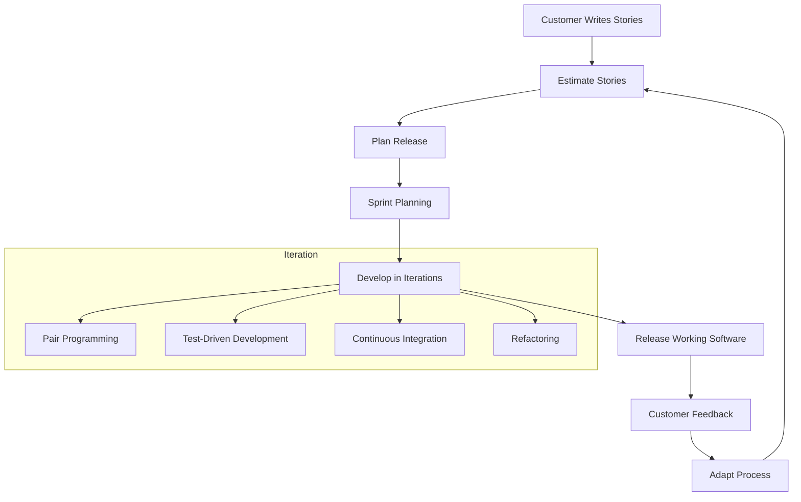

### XP Practices

| Practice | Description | Benefit |
|----------|-------------|---------|
| **Pair Programming** | Two developers at one workstation | Quality, knowledge sharing |
| **Test-Driven Development** | Write tests before code | Design clarity, safety net |
| **Continuous Integration** | Integrate code frequently | Early bug detection |
| **Refactoring** | Improve code without changing behavior | Technical debt reduction |
| **Collective Ownership** | Anyone can change any code | Flexibility, understanding |
| **Sustainable Pace** | Avoid burnout | Long-term productivity |
| **On-Site Customer** | Customer available full-time | Immediate feedback |
| **Small Releases** | Frequent, small deliveries | Reduced risk |

---

## 8. SCRUM

### SCRUM Process Flow

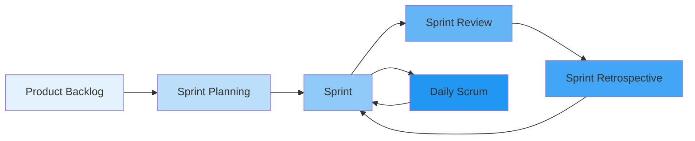

---

### SCRUM Roles

| Role | Responsibilities | Key Activities |
|------|------------------|----------------|
| **Product Owner** | Maximize product value | Manage backlog, prioritize |
| **Scrum Master** | Facilitate Scrum process | Remove impediments, coach team |
| **Development Team** | Deliver working software | Self-organize, cross-functional |

---

### SCRUM Artifacts

#### Product Backlog

| Component | Description |
|-----------|-------------|
| **User Stories** | Features from user perspective |
| **Prioritization** | MoSCoW (Must, Should, Could, Won't) |
| **Estimations** | Story points or T-shirt sizing |
| **Dependencies** | Relationships between items |

#### Sprint Backlog

| Component | Description |
|-----------|-------------|
| **Selected Stories** | Stories for this sprint |
| **Tasks** | Decomposed work items |
| **Burn-down Chart** | Progress tracking |

---

### SCRUM Ceremonies

#### Sprint Planning Meeting

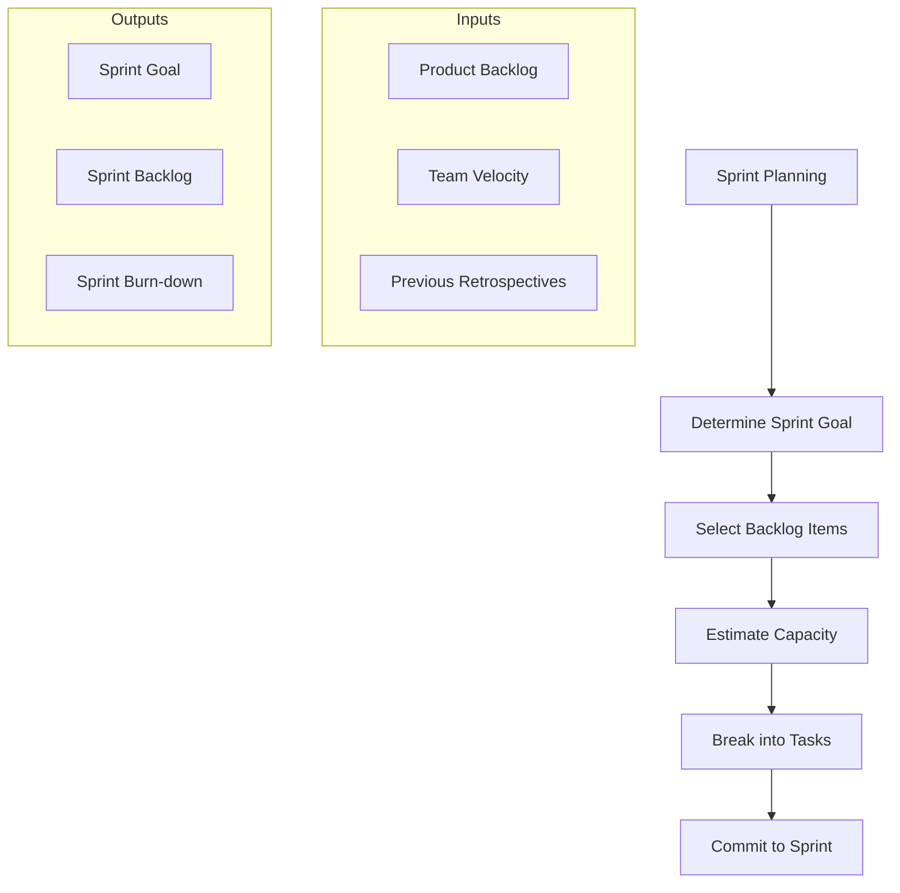

| Question | Answer |
|----------|--------|
| What can be delivered? | Selected product backlog items |
| How will work be achieved? | Task breakdown |

#### Daily Scrum (Stand-up)

| Element | Description | Timebox |
|---------|-------------|---------|
| What did I do yesterday? | Progress report | 2 min |
| What will I do today? | Plans | 2 min |
| Impediments? | Blockers | 2 min |

#### Sprint Review

| Purpose | Activities |
|---------|------------|
| Demonstrate completed work | Demo working software |
| Gather feedback | Stakeholder input |
| Adapt backlog | Re-prioritize if needed |

#### Sprint Retrospective

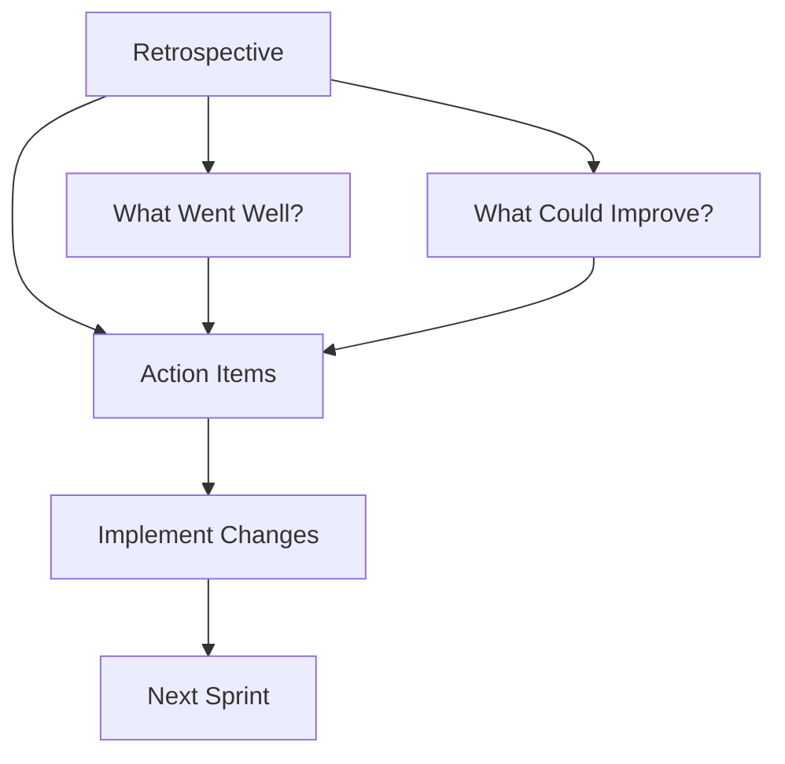

---

### Burn-down Chart

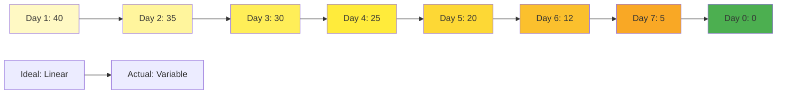

---

## 9. Industrial XP

### XP in Large Organizations

| Aspect | Traditional XP | Industrial XP |
|--------|----------------|---------------|
| Team Size | 5-10 | 50-100+ |
| Customer | On-site individual | Customer team |
| Planning | Release/iteration | Multiple levels |
| Integration | Individual | Automated pipeline |

### Scalability Considerations

- **Modular Teams**: Independent feature teams
- **Automated Processes**: CI/CD pipelines
- **Distributed XP**: Remote pair programming
- ** governance**: Lightweight policies

---

## 10. Agile Practices

### A. Test-Driven Development (TDD)

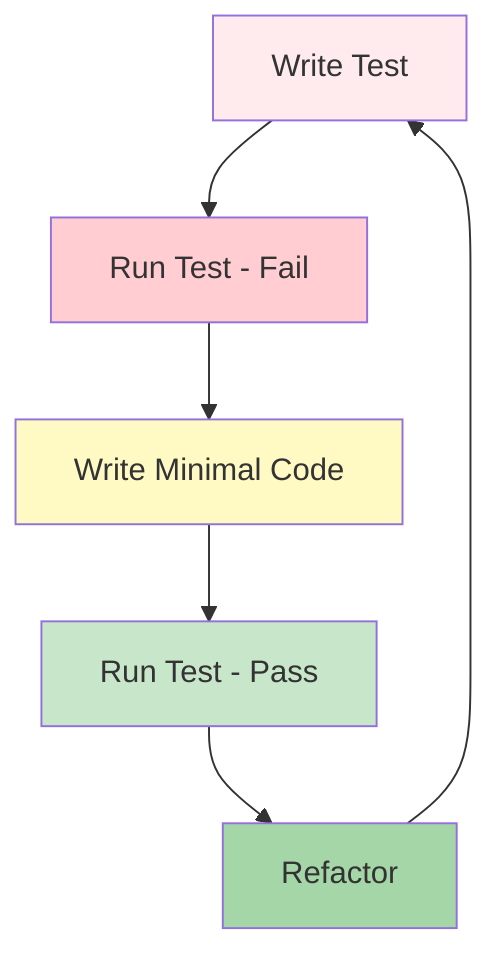

**Red-Green-Refactor Cycle:**
1. **Red**: Write failing test
2. **Green**: Write minimal code to pass
3. **Refactor**: Improve code while keeping tests passing

---

### B. Refactoring

| Code Smell | Refactoring Technique |
|------------|----------------------|
| Long Method | Extract Method |
| Large Class | Extract Class |
| Duplicate Code | Pull Up Method |
| Conditional Complexity | Replace Conditional with Polymorphism |

---

### C. Pair Programming

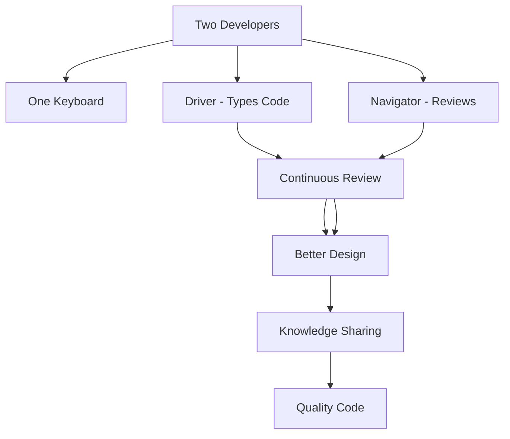

**Benefits**: Knowledge transfer, fewer defects, shared ownership

---

### D. Continuous Integration

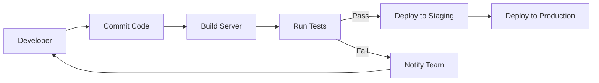

---

### E. Exploratory vs Scripted Testing

| Aspect | Scripted Testing | Exploratory Testing |
|--------|------------------|---------------------|
| Approach | Pre-written test cases | Ad-hoc investigation |
| Documentation | Detailed test scripts | Session notes |
| Coverage | Structured | Heuristic-based |
| Best For | Regression, compliance | New features, edge cases |

---

## 11. Summary

| Topic | Key Points |
|-------|------------|
| Agile Manifesto | Values individuals, working software, collaboration, change |
| XP Values | Communication, Simplicity, Feedback, Courage |
| SCRUM Roles | Product Owner, Scrum Master, Development Team |
| SCRUM Ceremonies | Sprint Planning, Daily Scrum, Review, Retrospective |
| Agile Practices | TDD, Pair Programming, CI, Refactoring |

---

## 12. Practical Exercise

### Questions
1. State the four values of the Agile Manifesto.
2. Explain the Red-Green-Refactor cycle of TDD.
3. What are the three SCRUM roles and their responsibilities?
4. Describe the difference between Product Backlog and Sprint Backlog.
5. List three benefits of pair programming.

### Assignment
Create a sample Sprint Backlog for CampusIntelli with at least 5 user stories and their tasks.

---

**Unit Completed**: [ ] Yes [ ] No  
**Date**: _____________  
**Signature**: _____________
