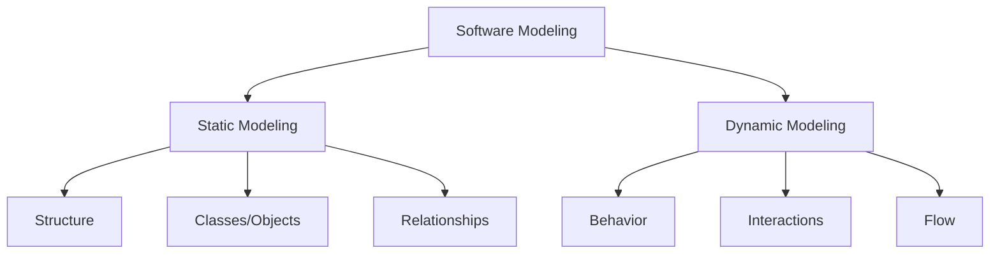
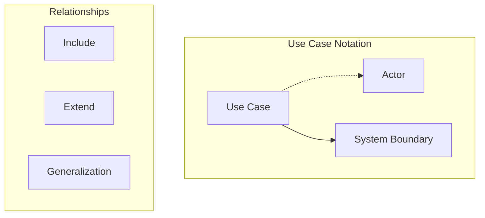
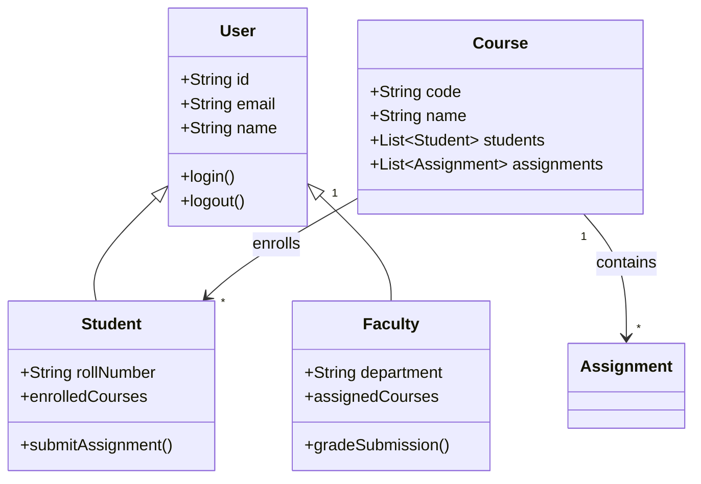
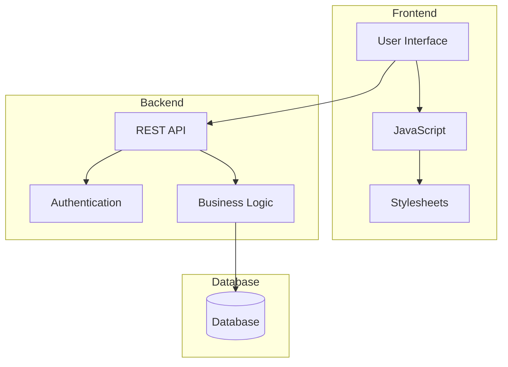
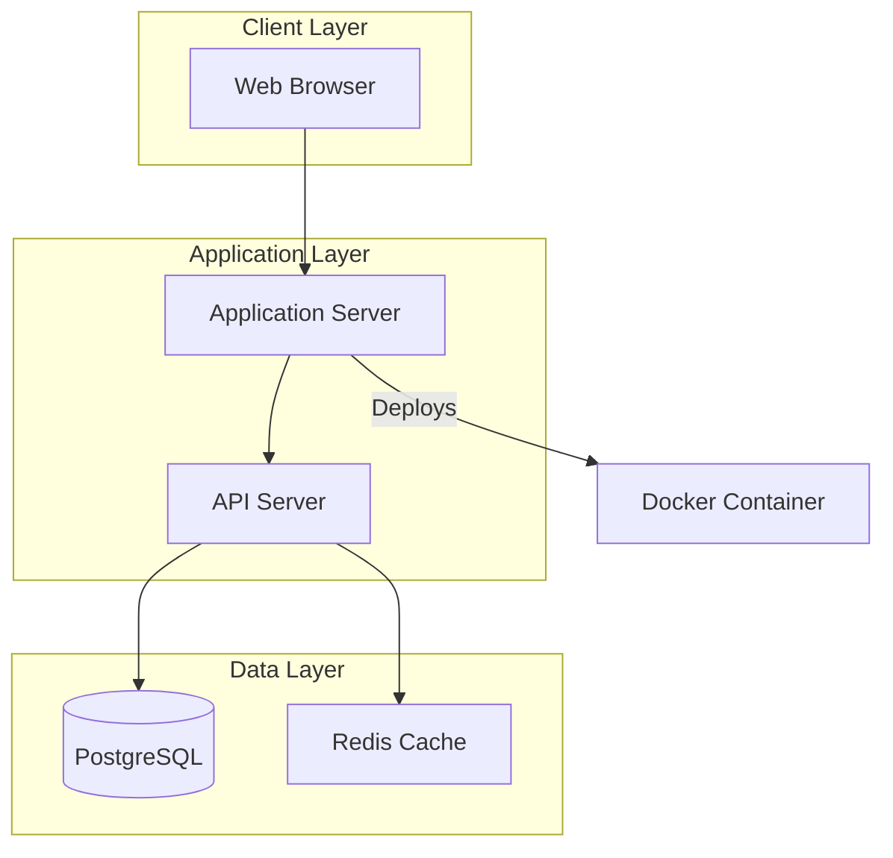
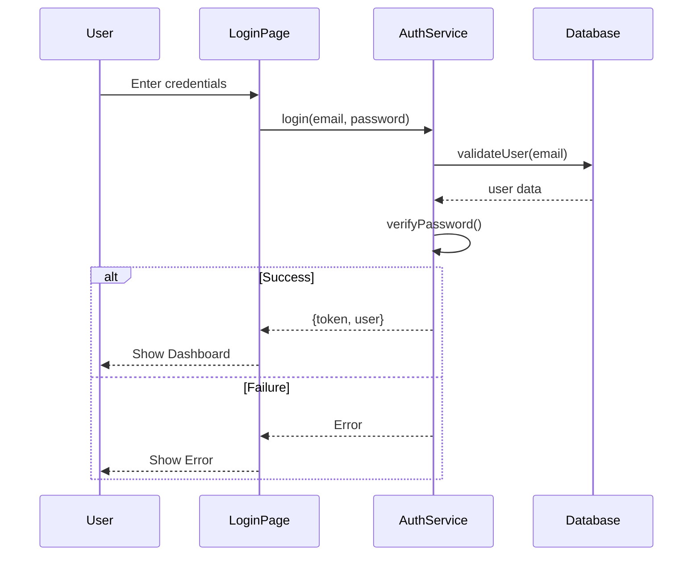
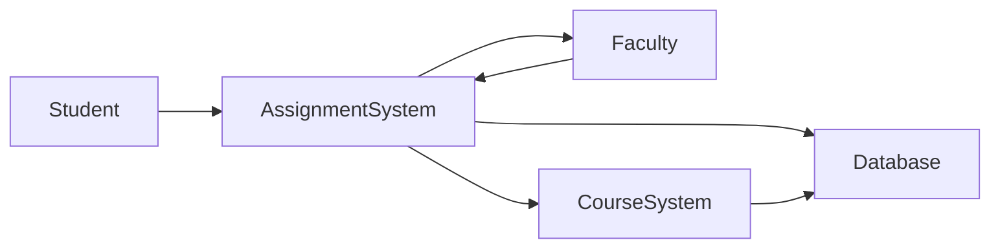
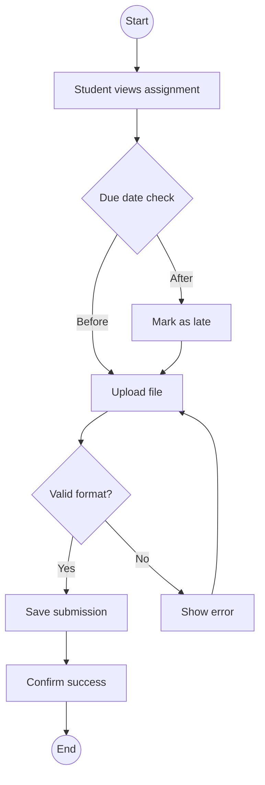
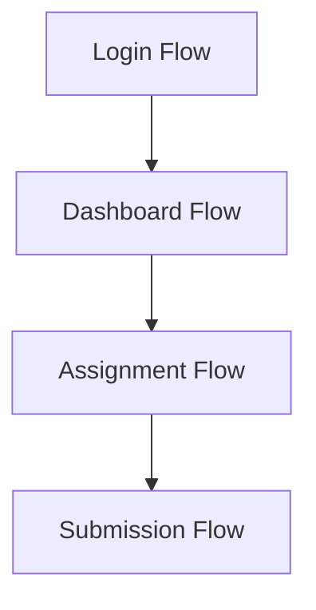
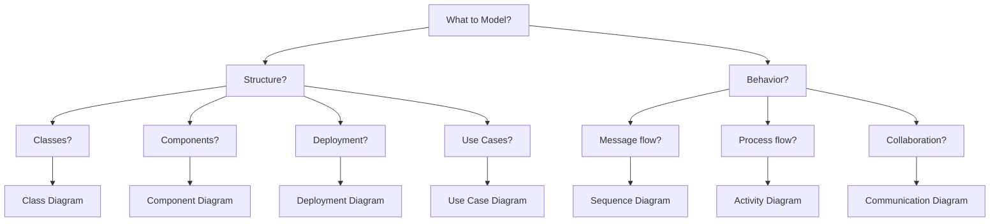

# Unit IV: Software Modeling - Static and Dynamic

**Duration**: 5 hours

---

## 1. Introduction to Software Modeling

### What is Modeling?



---

## 2. Static Modeling

### A. Use Case Diagram

#### Purpose
Shows actors, use cases, and their relationships to visualize system functionality.

#### Components



#### Use Case Diagram Example

```mermaid
graph TB
    subgraph "CampusIntelli System"
        UC1[Login]
        UC2[View Dashboard]
        UC3[Submit Assignment]
        UC4[Grade Assignment]
        UC5[Generate QR]
        UC6[Scan QR]
    end
    
    Student((Student))
    Faculty((Faculty))
    
    Student --> UC1
    Student --> UC2
    Student --> UC3
    Faculty --> UC1
    Faculty --> UC2
    Faculty --> UC4
    Faculty --> UC5
    Student --> UC6
    
    UC4 ..> UC5 : extends
```

#### Relationships

| Relationship | Notation | Meaning |
|--------------|----------|---------|
| Include | <<include>> | Mandatory inclusion |
| Extend | <<extend>> | Optional extension |
| Generalization | ─▷ | Inheritance |

---

### B. Class Diagram

#### Purpose
Shows classes, attributes, methods, and relationships in the system structure.

#### Class Notation

```
┌───────────────────────────────────────┐
│           Class Name                  │
├───────────────────────────────────────┤
│  - privateAttribute: Type             │
│  # protectedAttribute: Type           │
│  + publicAttribute: Type              │
├───────────────────────────────────────┤
│  + publicMethod(): ReturnType         │
│  # protectedMethod(): ReturnType      │
│  - privateMethod(): ReturnType        │
└───────────────────────────────────────┘
```

#### Relationships

| Symbol | Relationship | Description |
|--------|--------------|-------------|
| ──█ | Inheritance | A is-a B |
| ──◇ | Composition | A owns B (strong) |
| ──◇ | Aggregation | A has B (weak) |
| ──▷ | Association | A knows B |

#### Class Diagram Example



---

### C. Component Diagram

#### Purpose
Shows the organization of physical software components and their dependencies.

#### Example



---

### D. Deployment Diagram

#### Purpose
Shows the physical deployment of software components on hardware nodes.

#### Example



---

## 3. Dynamic Modeling

### A. Sequence Diagram

#### Purpose
Shows object interactions in a sequential order (message flow over time).

#### Components

| Symbol | Description |
|--------|-------------|
| ▭ | Lifeline (object) |
| ──▷ | Synchronous message |
| ──▷ | Asynchronous message |
| ──▷ | Return message |
| ⬜ | Activation box |
| ∥∥ | Alt (alternative) |

#### Sequence Diagram Example: Login



---

### B. Communication Diagram

#### Purpose
Shows object relationships and messages between them (emphasizes connections).

#### Example



---

### C. Activity Diagram

#### Purpose
Shows the flow of control between activities (business processes).

#### Components

| Symbol | Description |
|--------|-------------|
| ⬭ | Start node |
| ◉ | End node |
| ▭ | Activity |
| ◇ | Decision |
| ▷ | Control flow |

#### Activity Diagram Example: Assignment Submission



---

### D. Interaction Overview Diagram

#### Purpose
Shows sequence of interactions between multiple scenarios.

#### Example



---

## 4. UML Diagram Summary

| Diagram | Type | Purpose |
|---------|------|---------|
| Use Case | Static | Functional requirements |
| Class | Static | System structure |
| Component | Static | Component organization |
| Deployment | Static | Physical deployment |
| Sequence | Dynamic | Object interactions |
| Communication | Dynamic | Message flow |
| Activity | Dynamic | Business process |
| Interaction | Dynamic | Sequence overview |

---

## 5. UML in Practice

### Diagram Selection Guide



---

## 6. Summary

| Modeling Type | Key Diagrams | Focus |
|---------------|--------------|-------|
| **Static** | Use Case, Class, Component, Deployment | Structure, relationships |
| **Dynamic** | Sequence, Communication, Activity | Behavior, interactions |

---

## 7. Practical Exercise

### Questions
1. Draw a use case diagram for a library management system.
2. What is the difference between composition and aggregation in class diagrams?
3. Draw a sequence diagram for the "Withdraw Money" ATM transaction.
4. Explain when to use activity diagrams vs sequence diagrams.
5. Draw a class diagram for an online shopping system with Customer, Order, and Product classes.

### Assignment
Create UML diagrams for CampusIntelli:
- Use Case Diagram (main actors and use cases)
- Class Diagram (key classes and relationships)
- Sequence Diagram (user login process)

---

**Unit Completed**: [ ] Yes [ ] No  
**Date**: _____________  
**Signature**: _____________
