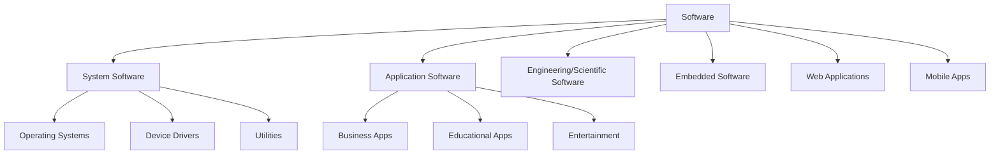
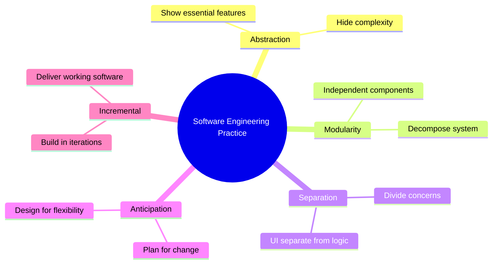
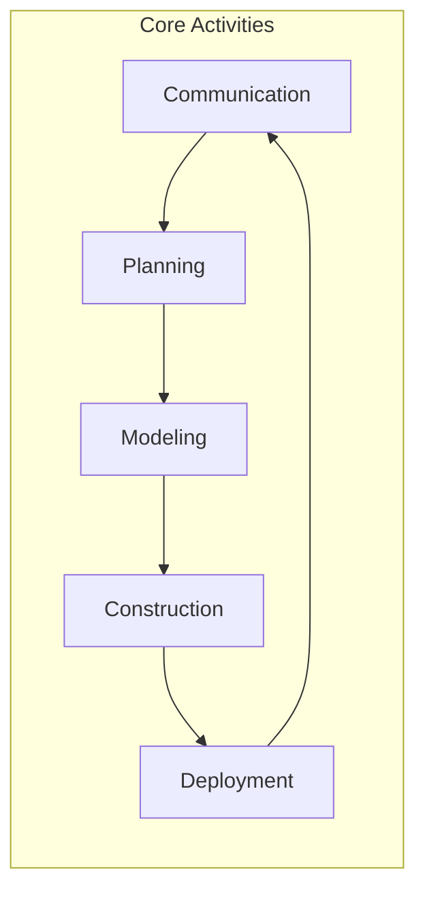
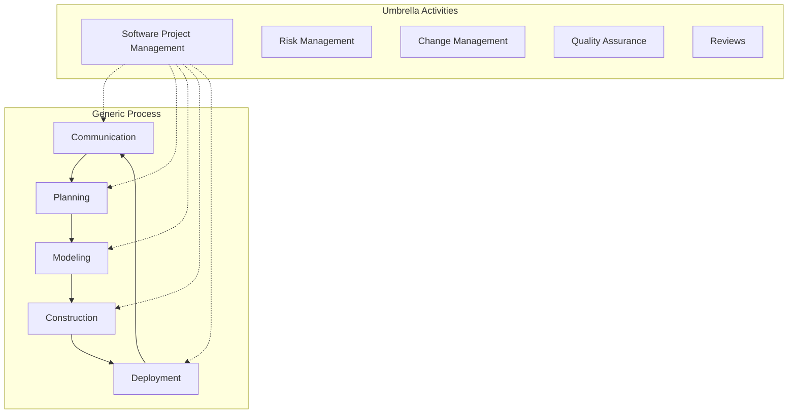
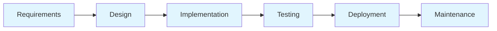
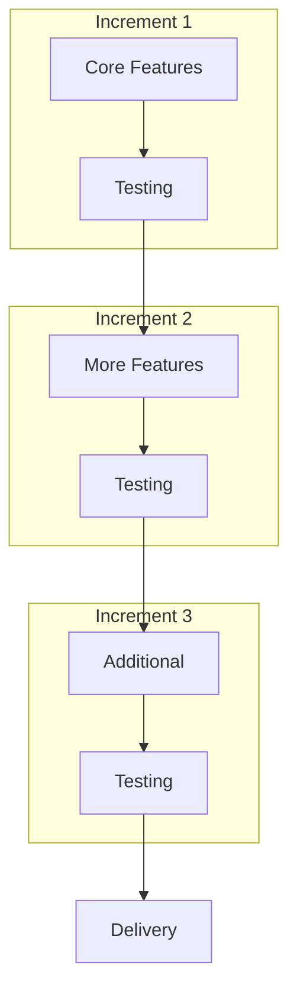
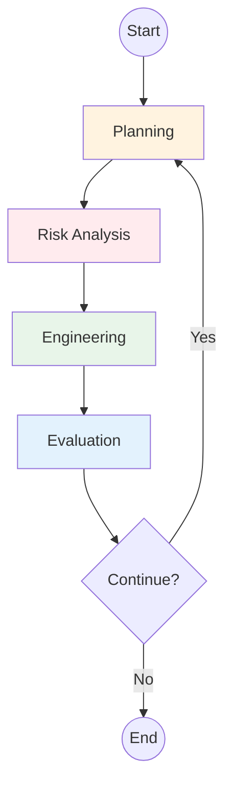
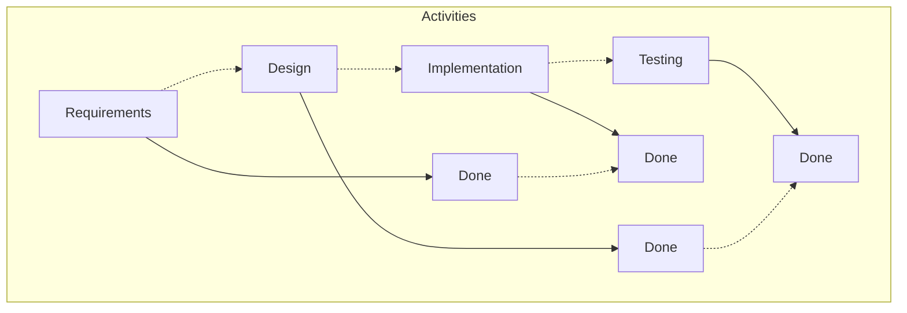
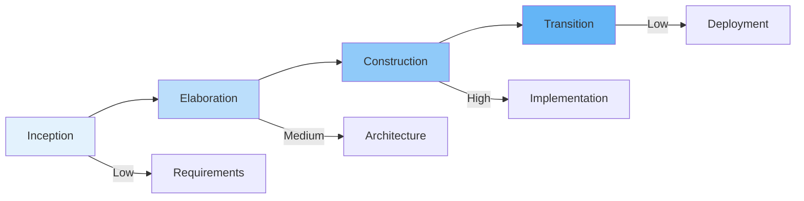
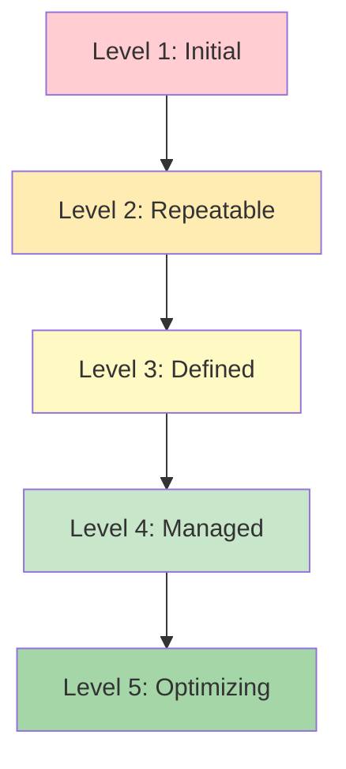

# Unit I: Introduction to Software Engineering

**Duration**: 4 hours

---

## 1. The Nature of Software

### What is Software?
Software is a set of instructions, data, and documentation that tells hardware how to perform specific tasks.

### Characteristics of Software

| Characteristic | Description |
|----------------|-------------|
| **Intangibility** | Cannot be touched or physically measured |
| **Complexity** | Becomes more complex with size |
| **Changeability** | Can be modified more easily than hardware |
| **Conformance to User** | Must meet user needs, not physical laws |
| **Discrete Nature** | Consists of discrete components |

### Types of Software

---

## 2. Software Engineering: Definition, Scope, and Importance

### Definition
> **Software Engineering** is the systematic, disciplined, and quantifiable approach to the development, operation, and maintenance of software.

### Scope of Software Engineering

| Area | Activities |
|------|------------|
| **Requirements** | Gathering, analyzing, documenting requirements |
| **Design** | Architectural and detailed design |
| **Construction** | Coding, testing, integration |
| **Verification** | Testing, validation, verification |
| **Evolution** | Maintenance, adaptation, enhancement |
| **Management** | Planning, scheduling, risk management |

### Importance of Software Engineering

1. **Quality Assurance**: Systematic processes ensure reliable software
2. **Cost Control**: Early defect detection reduces costs
3. **Schedule Management**: Predictable delivery timelines
4. **Maintainability**: Easier to modify and extend
5. **Risk Reduction**: Proactive risk identification

---

## 3. The Unique Nature of Web Applications

### Characteristics of Web Applications

| Characteristic | Description |
|----------------|-------------|
| **Network-centric** | Always connected to network/internet |
| **Multi-tier Architecture** | Presentation, business logic, data layers |
| **Cross-platform** | Runs on various devices/browsers |
| **Rapid Evolution** | Frequent updates and releases |
| **User Diversity** | Multiple user types with different needs |
| **Security Challenges** | Exposed to internet threats |

### Web vs Traditional Software

| Aspect | Traditional | Web Applications |
|--------|-------------|------------------|
| Deployment | Manual installation | Centralized server |
| Updates | User-dependent | Automatic |
| Access | Single device | Anywhere, any device |
| Scalability | Hardware-dependent | Elastic scaling |
| Offline | Full functionality | Limited/offline mode |

---

## 4. Software Engineering Practice

### Core Principles

### Best Practices

| Practice | Description | Benefit |
|----------|-------------|---------|
| **Code Reviews** | Peer examination of code | Defect detection |
| **Continuous Integration** | Frequent code integration | Early bug detection |
| **Automated Testing** | Scripted test execution | Regression prevention |
| **Documentation** | Comprehensive documentation | Knowledge transfer |
| **Version Control** | Track code changes | Collaboration, rollback |

---

## 5. Software Myths

### Management Myths

| Myth | Reality |
|------|---------|
| "We have a book of standards for developers" | Standards without enforcement are useless |
| "Adding people speeds up the project" | Brooks' Law: adding people makes it later |
| "If we fall behind, we can add more features later" | Features add to complexity and time |
| "Automated testing is too time-consuming" | Testing saves time by catching bugs early |

### Customer Myths

| Myth | Reality |
|------|---------|
| "Requirements are stable" | Requirements change throughout project |
| "Project can be completed once and forgotten" | Software requires ongoing maintenance |
| "Clear specifications mean no changes" | Changes are inevitable and manageable |

### Practitioner Myths

| Myth | Reality |
|------|---------|
| "Once it works, we're done" | Documentation, testing, maintenance continue |
| "Testing is not my job" | Quality is everyone's responsibility |
| "I can understand the whole system" | No one can hold entire system in mind |

---

## 6. The Software Process

### What is a Software Process?
A set of activities, methods, practices, and transformations that lead to a software product.

### Process Activities

| Activity | Description |
|----------|-------------|
| **Communication** | Stakeholder interaction, requirements gathering |
| **Planning** | Task definition, schedule, risk management |
| **Modeling** | Analysis, design using models |
| **Construction** | Coding, testing, integration |
| **Deployment** | Delivery, feedback, maintenance |

---

## 7. Generic Process Model

### Framework Activities

---

## 8. Prescriptive Process Models

### A. Waterfall Model

| Phase | Activities |
|-------|------------|
| **Requirements** | Elicitation, analysis, specification |
| **Design** | Architectural, detailed design |
| **Implementation** | Coding, unit testing |
| **Testing** | Integration, system testing |
| **Deployment** | Release, installation |
| **Maintenance** | Corrective, adaptive, perfective |

**Pros**: Simple, well-understood phases, clear milestones  
**Cons**: Inflexible, late testing, high risk

---

### B. Incremental Model

**Pros**: Early delivery, feedback incorporation, reduced risk  
**Cons**: Planning complexity, architecture challenges

---

### C. Evolutionary Process Models

#### Spiral Model

| Quadrant | Activities |
|----------|------------|
| **Planning** | Determine objectives, alternatives |
| **Risk Analysis** | Assess risks, prototype |
| **Engineering** | Development, testing |
| **Evaluation** | Customer evaluation, planning next iteration |

**Pros**: Risk-driven, accommodates changes, early prototypes  
**Cons**: Complex, requires risk expertise

---

### D. Concurrent Models

All activities exist in concurrent states (initial, in-progress, done, changes-pending)

---

### E. Unified Process (UP)

| Phase | Focus | Deliverables |
|-------|-------|--------------|
| **Inception** | Scope, vision, business case | Vision document, use cases |
| **Elaboration** | Architecture, requirements | Architecture doc, refined use cases |
| **Construction** | Development, testing | Working software, manuals |
| **Transition** | Deployment, feedback | Released product |

---

### F. Personal Software Process (PSP)

| Level | Focus | Activities |
|-------|-------|------------|
| **PSP0** | Basic process | Time tracking, defect recording |
| **PSP1** | Planning | Size estimation, schedule planning |
| **PSP2** | Quality | Design reviews, code reviews |
| **PSP3** | Process improvement | Personal process optimization |

**Benefits**: Improved estimation, defect reduction, personal productivity

---

### G. Team Software Process (TSP)

| Role | Responsibilities |
|------|------------------|
| **Team Leader** | Project management, coaching |
| **Quality Manager** | Quality assurance, reviews |
| **Planning Manager** | Schedule, task allocation |
| **Support Manager** | Tools, environment |

**Principles**: Self-managing teams, quality focus, defined process

---

## 9. Process Assessment and Improvement

### Capability Maturity Model (CMM)

| Level | Name | Characteristics |
|-------|------|-----------------|
| 1 | Initial | Ad-hoc, unpredictable processes |
| 2 | Repeatable | Basic project management |
| 3 | Defined | Organizational standards |
| 4 | Managed | Quantitative process control |
| 5 | Optimizing | Continuous improvement |

---

## 10. Summary

| Topic | Key Points |
|-------|------------|
| Software Characteristics | Intangible, complex, changeable |
| Software Engineering | Systematic, disciplined approach |
| Web Applications | Network-centric, multi-tier, cross-platform |
| Software Myths | Misconceptions about development |
| Process Models | Waterfall, Incremental, Spiral, Unified |
| Process Improvement | CMM levels, PSP/TSP |

---

## 11. Practical Exercise

### Questions
1. Explain the difference between software and programs.
2. List three characteristics that distinguish web applications from traditional software.
3. Describe the Waterfall model with its advantages and disadvantages.
4. What is the Spiral model and why is it considered risk-driven?
5. Explain the four phases of the Unified Process.

### Assignment
Compare two process models (Waterfall vs Agile) and identify scenarios where each is most appropriate.

---

**Unit Completed**: [ ] Yes [ ] No  
**Date**: _____________  
**Signature**: _____________
