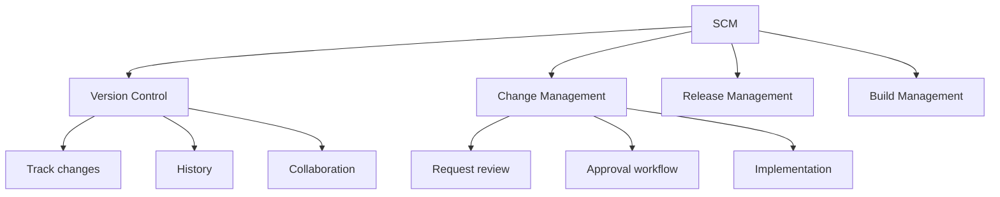
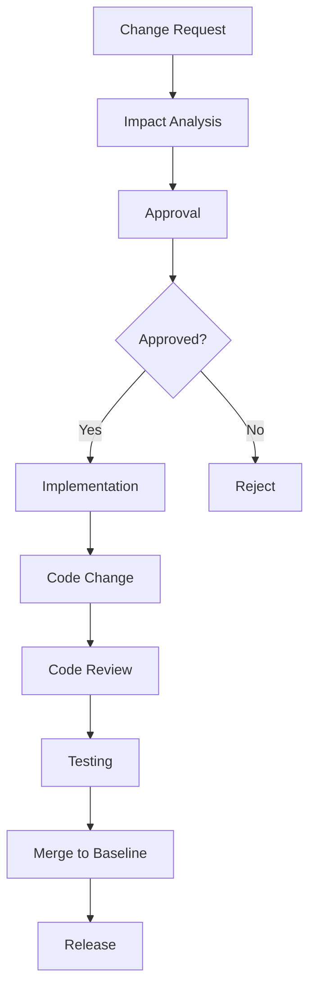
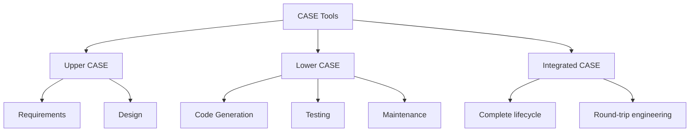
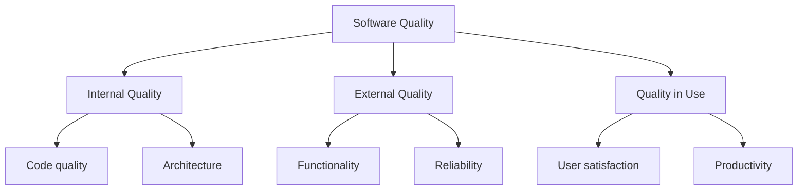
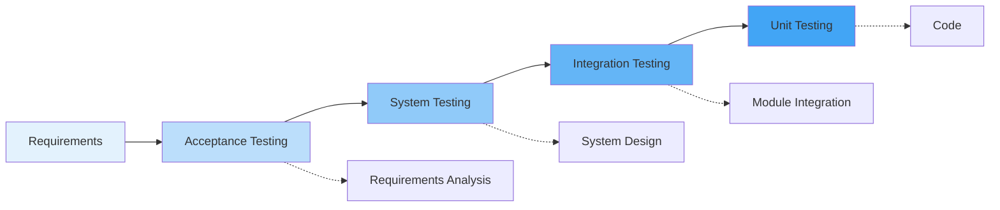
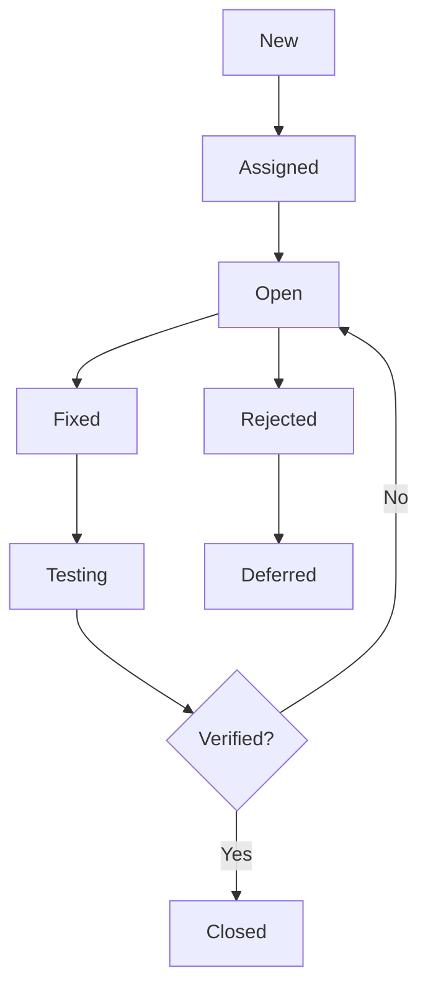
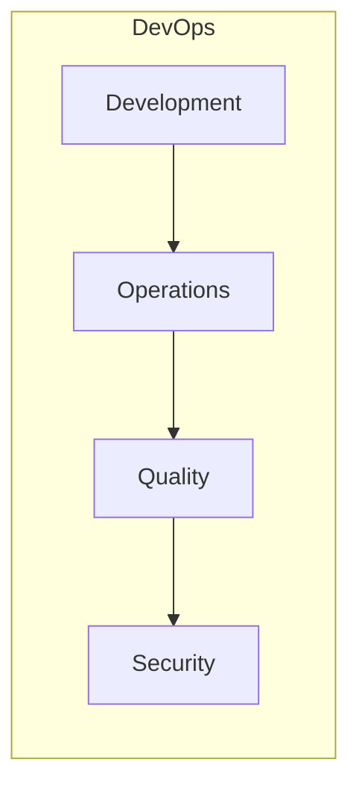
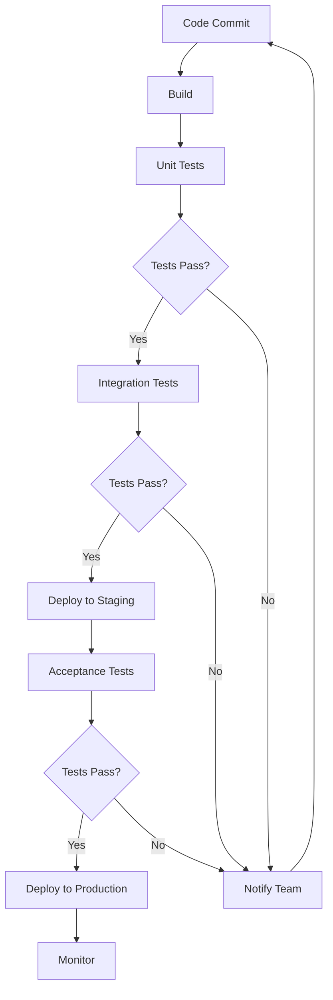

# Unit VI: Configuration & Quality Assurance

**Duration**: 4 hours

---

## 1. Software Configuration Management (SCM)

### What is SCM?



---

## 2. SCM Basics

### Key Concepts

| Concept | Description | Example |
|---------|-------------|---------|
| **Configuration Item** | Work product under control | Code, docs, models |
| **Baseline** | Approved configuration | Release 1.0 |
| **Version** | Specific iteration of item | v1.2.3 |
| **Revision** | Change to a version | Patch, update |

---

## 3. SCM Repository

### Repository Structure

```
┌─────────────────────────────────────┐
│         Repository Root              │
├─────────────────────────────────────┤
│  ┌── trunk/                         │
│  │    └── main code                 │
│  ├── branches/                      │
│  │    └── feature branches          │
│  └── tags/                          │
│       └── releases (v1.0, v2.0)     │
└─────────────────────────────────────┘
```

### Version Control Systems

| System | Type | Key Features |
|--------|------|--------------|
| **Git** | Distributed | Branching, merging |
| **SVN** | Centralized | Atomic commits |
| **Mercurial** | Distributed | Simple interface |
| **Perforce** | Centralized | Large files |

---

## 4. SCM Process



### SCM Activities

| Activity | Description | Tools |
|----------|-------------|-------|
| **Check-out** | Get working copy | git checkout |
| **Check-in** | Commit changes | git commit |
| **Branch** | Create independent line | git branch |
| **Merge** | Combine branches | git merge |
| **Conflict Resolution** | Resolve merge conflicts | Manual/merge tool |
| **Tag** | Mark release point | git tag |

---

## 5. CASE Tools

### Taxonomy



---

### Upper CASE Tools

| Tool | Purpose |
|------|---------|
| **IBM DOORS** | Requirements management |
| **Enterprise Architect** | UML modeling |
| **Visio** | Diagramming |
| **Lucidchart** | Cloud-based diagrams |

---

### Lower CASE Tools

| Tool | Purpose |
|------|---------|
| **SonarQube** | Code analysis |
| **JUnit** | Unit testing |
| **Selenium** | Automated testing |
| **Jenkins** | Build automation |

---

### Integrated CASE Tools

| Tool | Features |
|------|----------|
| **Visual Studio** | IDE + modeling + testing |
| **IntelliJ IDEA** | IDE + refactoring |
| **Eclipse** | Extensible IDE |

---

## 6. Software Quality & SQA

### Quality Dimensions



### Quality Factors (McCall's Model)

| Category | Factors |
|----------|---------|
| **Operational** | Correctness, reliability, efficiency, integrity, usability |
| **Maintenance** | Flexibility, maintainability, testability |
| **Transition** | Portability, reusability, interoperability |

---

## 7. Verification and Validation

### V-Model



| Verification | Validation |
|--------------|------------|
| "Are we building it right?" | "Are we building the right thing?" |
| Process-focused | Product-focused |
| Reviews, testing | Testing with users |

---

## 8. Defect Management

### Defect Life Cycle



---

### Defect States

| State | Description |
|-------|-------------|
| **New** | Just reported |
| **Open** | Assigned to developer |
| **Fixed** | Code changed |
| **Reopened** | Fix didn't work |
| **Closed** | Verified fixed |
| **Rejected** | Not a defect |
| **Deferred** | Not for this release |

---

## 9. Bug Reporting

### Bug Report Template

```markdown
## Bug Report

**ID**: BUG-001
**Title**: Login fails with valid credentials
**Priority**: High
**Severity**: Critical

**Steps to Reproduce**:
1. Go to login page
2. Enter valid credentials
3. Click Login

**Expected**: Dashboard should display
**Actual**: Error message displayed

**Environment**:
- Browser: Chrome 120
- OS: Windows 11

**Attachments**:
- Screenshot
- Log file
```

---

## 10. DevOps

### What is DevOps?



### DevOps Principles

| Principle | Description |
|-----------|-------------|
| **Collaboration** | Break down silos |
| **Automation** | Automate everything |
| **Continuous** | CI/CD pipelines |
| **Monitoring** | Feedback loops |
| **Rapid Delivery** | Short iterations |

---

### Agile vs DevOps

| Aspect | Agile | DevOps |
|--------|-------|--------|
| Focus | Development process | Development + Operations |
| Goal | Deliver working software | Continuous delivery |
| Feedback | Sprint reviews | Real-time monitoring |
| Deployment | End of sprint | Continuous |

---

### Agile Project Management Tools

| Tool | Purpose |
|------|---------|
| **Jira** | Scrum/Kanban boards |
| **Trello** | Visual task management |
| **Azure DevOps** | Complete ALM |
| **Asana** | Team collaboration |
| **Monday.com** | Project tracking |

---

### DevOps Practices

| Practice | Description | Benefit |
|----------|-------------|---------|
| **CI/CD** | Continuous Integration/Deployment | Faster releases |
| **Infrastructure as Code** | Terraform, Ansible | Reproducible environments |
| **Monitoring** | Prometheus, Grafana | Proactive issue detection |
| **Containerization** | Docker, Kubernetes | Consistent deployment |
| **Microservices** | Architecture pattern | Scalability |

---

### CI/CD Tools

| Tool | Purpose |
|------|---------|
| **Jenkins** | Build automation |
| **GitHub Actions** | CI/CD workflows |
| **GitLab CI** | Integrated CI/CD |
| **CircleCI** | Cloud CI/CD |
| **Docker** | Containerization |
| **Kubernetes** | Container orchestration |

---

### CI/CD Pipeline



---

## 11. Evolution from Traditional to Agile and DevOps

### Traditional vs Modern Approach

| Aspect | Traditional | Agile + DevOps |
|--------|-------------|----------------|
| Release Cycle | Months/years | Days/weeks |
| Feedback | Delayed | Continuous |
| Deployment | Manual | Automated |
| Infrastructure | Physical servers | Cloud + containers |
| Monitoring | Periodic reviews | Real-time |
| Collaboration | Siloed | Integrated |

---

## 12. Summary

| Topic | Key Points |
|-------|------------|
| SCM | Version control, change management, baselines |
| CASE Tools | Upper, Lower, Integrated categories |
| SQA | Quality dimensions, factors, models |
| V&V | Verification vs Validation |
| Defect Management | Life cycle, bug reporting |
| DevOps | Principles, practices, CI/CD |

---

## 13. Practical Exercise

### Questions
1. Explain the difference between verification and validation.
2. Describe the SCM process with activities.
3. What are the states in the defect life cycle?
4. List three CI/CD tools and their purposes.
5. Explain the difference between Agile and DevOps.

### Assignment
1. Create a bug report template for CampusIntelli.
2. Design a CI/CD pipeline for deploying CampusIntelli.

---

**Unit Completed**: [ ] Yes [ ] No  
**Date**: _____________  
**Signature**: _____________
