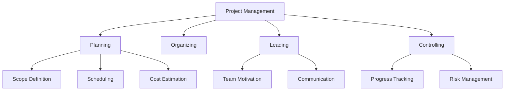
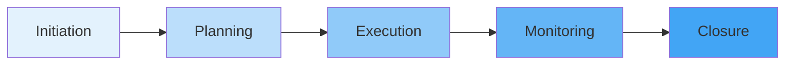
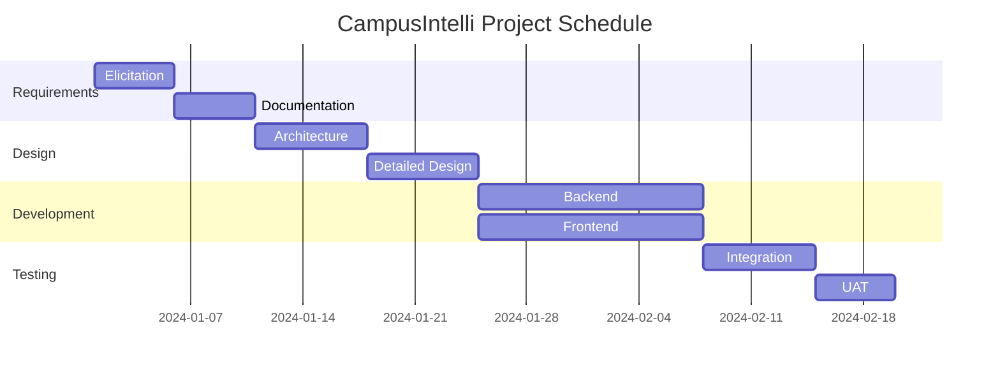
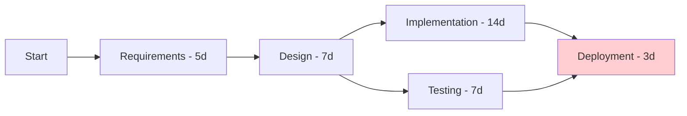
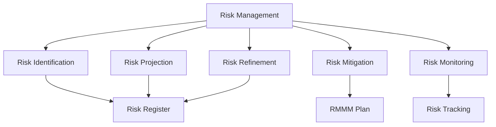

# Unit V: Software Project Management

**Duration**: 5 hours

---

## 1. Introduction to Software Project Management

### What is Project Management?



---

## 2. Project Management Life Cycle



---

## 3. Project Planning and Scheduling

### A. Gantt Chart

#### Purpose
Visual representation of project schedule showing tasks, duration, and dependencies.

#### Gantt Chart Example

| Task | Week 1 | Week 2 | Week 3 | Week 4 |
|------|--------|--------|--------|--------|
| Requirements | ████ | | | |
| Design | ░░░░ | ████ | | |
| Implementation | | ░░░░ | ████ | |
| Testing | | | ░░░░ | ████ |
| Deployment | | | | ░░░░ |

#### Gantt Chart Visualization



---

### B. PERT Chart

#### Purpose
Program Evaluation and Review Technique - shows task dependencies and critical path.

#### PERT Formula

```
Expected Time (Te) = (O + 4M + P) / 6
Where:
    O = Optimistic time
    M = Most likely time
    P = Pessimistic time
```

#### PERT Example



---

### C. CPM (Critical Path Method)

#### Purpose
Identifies the longest sequence of tasks that determines project duration.

#### Critical Path Characteristics

| Task | Duration | Predecessors | Slack |
|------|----------|--------------|-------|
| A | 5 | None | 0 |
| B | 7 | A | 0 |
| C | 14 | B | 0 |
| D | 7 | B | 5 |
| E | 3 | C, D | 0 |

**Critical Path**: A → B → C → E (Total: 29 days)

---

## 4. Cost Estimation Models

### A. COCOMO (Constructive Cost Model)

#### Basic COCOMO Formula

```
Effort = a × (KLOC)^b
Time = c × (Effort)^d
People = Effort / Time
```

#### COCOMO Types

| Model Type | Formula | Use Case |
|------------|---------|----------|
| **Basic** | Simple multiplication | Early estimates |
| **Intermediate** | Adjusts for cost drivers | Detailed estimates |
| **Detailed** | Phase-level adjustments | Final estimates |

#### COCOMO II Constants

| Project Type | a | b | c | d |
|--------------|---|---|---|---|
| Organic | 2.4 | 1.05 | 2.5 | 0.38 |
| Semi-detached | 3.0 | 1.12 | 2.5 | 0.35 |
| Embedded | 3.6 | 1.20 | 2.5 | 0.32 |

#### Example Calculation

```
Project Size: 10 KLOC (Organic)
Effort = 2.4 × (10)^1.05 = 2.4 × 11.22 = 26.9 person-months
Time = 2.5 × (26.9)^0.38 = 2.5 × 3.57 = 8.9 months
People = 26.9 / 8.9 ≈ 3 persons
```

---

### B. Function Point Analysis (FPA)

#### Function Point Components

| Component | Description | Weight Range |
|-----------|-------------|--------------|
| **ILF** | Internal Logical Files | 7-15 |
| **EIF** | External Interface Files | 5-10 |
| **EI** | External Inputs | 3-6 |
| **EO** | External Outputs | 4-7 |
| **EQ** | External Inquiries | 3-6 |

#### Function Point Calculation

```
UFP = Sum of all complexity weights
VAF = 0.65 + 0.01 × Σ(Fi)
FP = UFP × VAF

Where Fi = complexity adjustment factors
```

#### Example

| Element | Count | Weight | Value |
|---------|-------|--------|-------|
| ILF | 2 | 10 | 20 |
| EI | 5 | 4 | 20 |
| EO | 3 | 5 | 15 |
| EQ | 2 | 4 | 8 |
| **UFP** | | | **63** |

```
VAF = 0.65 + 0.01 × 35 = 1.0
FP = 63 × 1.0 = 63 FP
```

---

## 5. Risk Management

### Risk Management Process



---

### Risk Identification

| Category | Examples |
|----------|----------|
| **Technical** | New technology, performance issues |
| **Schedule** | Unrealistic deadlines |
| **Resource** | Key personnel leaving |
| **Requirements** | Changing requirements |
| **External** | Vendor delays, regulations |

---

### Risk Projection

#### Risk Matrix

| Probability | Impact | Risk Level |
|-------------|---------|------------|
| High | High | Critical |
| High | Medium | High |
| Medium | High | High |
| Medium | Medium | Medium |
| Low | High |
| Low | | Medium Medium | Low |
| Low | Low | Low |

---

### Risk Refinement

| Activity | Description |
|----------|-------------|
| Risk decomposition | Break into smaller, manageable risks |
| Risk quantification | Assign probability and impact values |
| Dependency analysis | Identify risk relationships |

---

### Risk Mitigation

| Strategy | Action | Example |
|----------|--------|---------|
| **Avoid** | Eliminate the risk | Change requirements |
| **Transfer** | Shift to third party | Insurance, outsourcing |
| **Mitigate** | Reduce probability/impact | Prototypes, backups |
| **Accept** | Plan for occurrence | Contingency plans |

---

### RMMM Plan (Risk Mitigation, Monitoring, and Management)

```markdown
| Risk ID | Description | Probability | Impact | Mitigation | Contingency |
|---------|------------|-------------|--------|------------|-------------|
| R001 | Key developer leaves | Low | High | Cross-training | Hire backup |
| R002 | Requirements change | High | Medium | Agile methodology | Flexible design |
| R003 | Technology failure | Medium | High | Prototyping | Alternative tech |
```

---

## 6. Summary

| Topic | Key Points |
|-------|------------|
| Project Management | Planning, organizing, leading, controlling |
| Gantt Chart | Visual schedule with tasks and dependencies |
| PERT/CPM | Critical path analysis for scheduling |
| COCOMO | Effort estimation based on size |
| Function Points | Size measurement based on functionality |
| Risk Management | Identification, projection, mitigation, monitoring |

---

## 7. Practical Exercise

### Questions
1. What is the difference between PERT and CPM?
2. Calculate effort using COCOMO for a 20 KLOC embedded system.
3. List three risk mitigation strategies with examples.
4. Explain the components of Function Point Analysis.
5. Create a simple Gantt chart for a 4-week project.

### Assignment
1. Estimate effort for CampusIntelli using both COCOMO and Function Points.
2. Create a risk register with at least 5 risks and mitigation plans.

---

**Unit Completed**: [ ] Yes [ ] No  
**Date**: _____________  
**Signature**: _____________
